> Date: 15/01/2026
>
> Ref: FDR4VGT-processing-AC-ATBD_v1.1
>
> Contract No : FDR4VGT_XXXXXX

Contributors

> **HYGEOS**
>
> Didier Ramon, Dominique Jolivet, Nathan Capon, Mathieu Compiègne, N. Lyot, B. Monsterleet

History of modifications

+-------------+------------+-----------------------------------+-------------------------------------------------------------------------------------------------------------+
| **Version** | **Date**   | **Description of modification**   | **Chapters / Sections**                                                                                     |
+:============+:===========+:==================================+:============================================================================================================+
| V1.0        | 15/01/2026 | Draft Initial version             | All                                                                                                         |
+-------------+------------+-----------------------------------+-------------------------------------------------------------------------------------------------------------+
| V1.1        | 17/07/2026 | Implementation notes, performance | optimizations, float32 overflow fix, known limitations, SMACCL OpenCL kernel API New Appendix D, Appendix E |
+-------------+------------+-----------------------------------+-------------------------------------------------------------------------------------------------------------+

Related documents

**Input**

|                               |
|:------------------------------|
| **Reference ID** **Document** |

------------------------------------------------------------------------

**Output**

|                               |
|:------------------------------|
| **Reference ID** **Document** |

------------------------------------------------------------------------

**External documents**

|                               |
|:------------------------------|
| **Reference ID** **Document** |

------------------------------------------------------------------------

\*\*\*\*

Acronyms

+-------------+---------------------------------------------------------------------------------------------------------+
| **Acronym** | **Definition**                                                                                          |
+:============+:========================================================================================================+
| 6S          | Second Simulation of the Satellite Signal in the Solar Spectrum                                         |
+-------------+---------------------------------------------------------------------------------------------------------+
| AERONET     | Aerosol Robotic Network                                                                                 |
+-------------+---------------------------------------------------------------------------------------------------------+
| AC          | Atmospheric Correction                                                                                  |
+-------------+---------------------------------------------------------------------------------------------------------+
| ACIX2       | Atmospheric Corrections Intercomparison eXercise II                                                     |
+-------------+---------------------------------------------------------------------------------------------------------+
| AMIP        | MERRA-2 Atmospheric Model Intercomparison Project                                                       |
+-------------+---------------------------------------------------------------------------------------------------------+
| AOT         | Aerosol Optical Thickness                                                                               |
+-------------+---------------------------------------------------------------------------------------------------------+
| ATBD        | Algorithm Theoretical Basis Document                                                                    |
+-------------+---------------------------------------------------------------------------------------------------------+
| BC          | Black Carbon aerosols                                                                                   |
+-------------+---------------------------------------------------------------------------------------------------------+
| BRDF        | Bi-directional Reflectance Distribution Function                                                        |
+-------------+---------------------------------------------------------------------------------------------------------+
| BSA         | Black-Sky Albedo                                                                                        |
+-------------+---------------------------------------------------------------------------------------------------------+
| C3S         | Copernicus Climate Change                                                                               |
+-------------+---------------------------------------------------------------------------------------------------------+
| C3SAL       | C3S ALbedo                                                                                              |
+-------------+---------------------------------------------------------------------------------------------------------+
| CAMS        | Copernicus Atmosphere Monitoring Service                                                                |
+-------------+---------------------------------------------------------------------------------------------------------+
| CDR         | Climate Data Record                                                                                     |
+-------------+---------------------------------------------------------------------------------------------------------+
| CGLS        | Copernicus Global Land Service                                                                          |
+-------------+---------------------------------------------------------------------------------------------------------+
| CUDA        | Compute Unified Device Architecture                                                                     |
+-------------+---------------------------------------------------------------------------------------------------------+
| DEM         | Digital Elevation Model                                                                                 |
+-------------+---------------------------------------------------------------------------------------------------------+
| DU          | Dust aerosols                                                                                           |
+-------------+---------------------------------------------------------------------------------------------------------+
| ECV         | Essential Climate Variables                                                                             |
+-------------+---------------------------------------------------------------------------------------------------------+
| EOS         | Earth Observation Satellites                                                                            |
+-------------+---------------------------------------------------------------------------------------------------------+
| ETAL        | EPS Ten-daily ALbedo                                                                                    |
+-------------+---------------------------------------------------------------------------------------------------------+
| FCDR        | Fundamental Climate Data Record                                                                         |
+-------------+---------------------------------------------------------------------------------------------------------+
| FIDUCEO     | FIDelity and Uncertainty in Climate data records from Earth Observation                                 |
+-------------+---------------------------------------------------------------------------------------------------------+
| GCOS        | Global Climate Observing System                                                                         |
+-------------+---------------------------------------------------------------------------------------------------------+
| GEOS        | Goddard Earth Observing System                                                                          |
+-------------+---------------------------------------------------------------------------------------------------------+
| GPL         | GNU Public Licence                                                                                      |
+-------------+---------------------------------------------------------------------------------------------------------+
| GPU         | Graphics Processing Unit                                                                                |
+-------------+---------------------------------------------------------------------------------------------------------+
| HDF4        | Hierarchical Data Format4                                                                               |
+-------------+---------------------------------------------------------------------------------------------------------+
| MERRA-2     | Modern-Era Retrospective analysis for Research and Applications, Version 2                              |
+-------------+---------------------------------------------------------------------------------------------------------+
| MIR         | Medium InfraRed                                                                                         |
+-------------+---------------------------------------------------------------------------------------------------------+
| NetCDF      | Network Common Data Form                                                                                |
+-------------+---------------------------------------------------------------------------------------------------------+
| NIR         | Near InfraRed                                                                                           |
+-------------+---------------------------------------------------------------------------------------------------------+
| NRT         | Near Real Time                                                                                          |
+-------------+---------------------------------------------------------------------------------------------------------+
| OC          | Organic Carbon aerosols                                                                                 |
+-------------+---------------------------------------------------------------------------------------------------------+
| PUGS        | Product User Guide Specification                                                                        |
+-------------+---------------------------------------------------------------------------------------------------------+
| PUM         | Product User Manual                                                                                     |
+-------------+---------------------------------------------------------------------------------------------------------+
| PQAR        | Product Quality Assessment Report                                                                       |
+-------------+---------------------------------------------------------------------------------------------------------+
| RSRF        | Relative Spectral Response Function                                                                     |
+-------------+---------------------------------------------------------------------------------------------------------+
| RSS         | Residual Sum of Square                                                                                  |
+-------------+---------------------------------------------------------------------------------------------------------+
| SA          | Surface Albedo                                                                                          |
+-------------+---------------------------------------------------------------------------------------------------------+
| SAA         | Sun Azimuth Angle                                                                                       |
+-------------+---------------------------------------------------------------------------------------------------------+
| SMAC        | Simplified Model for Atmospheric Corrections                                                            |
+-------------+---------------------------------------------------------------------------------------------------------+
| SMAC-CL     | SMAC model implemented with OPEN-CL language                                                            |
+-------------+---------------------------------------------------------------------------------------------------------+
| SPOT        | Satellite Probatoire d'Observation de la Terre                                                          |
+-------------+---------------------------------------------------------------------------------------------------------+
| SRF         | Spectral Response Function                                                                              |
+-------------+---------------------------------------------------------------------------------------------------------+
| SS          | Sea Salt aerosols                                                                                       |
+-------------+---------------------------------------------------------------------------------------------------------+
| SU          | SUlphate aerosols                                                                                       |
+-------------+---------------------------------------------------------------------------------------------------------+
| SWIR        | Short-Wave InfraRed                                                                                     |
+-------------+---------------------------------------------------------------------------------------------------------+
| SZA         | Sun Zenith Angle                                                                                        |
+-------------+---------------------------------------------------------------------------------------------------------+
| TOA         | Top Of the Atmosphere                                                                                   |
+-------------+---------------------------------------------------------------------------------------------------------+
| TOC         | Top Of Canopy                                                                                           |
+-------------+---------------------------------------------------------------------------------------------------------+
| TOC-r       | Top Of Canopy Reflectance                                                                               |
+-------------+---------------------------------------------------------------------------------------------------------+
| UTC         | Universal Time Coordinates                                                                              |
+-------------+---------------------------------------------------------------------------------------------------------+
| VAA         | View Azimuth Angle                                                                                      |
+-------------+---------------------------------------------------------------------------------------------------------+
| VEGETATION  | The medium resolution sensor onboard SPOT4 and SPOT5                                                    |
+-------------+---------------------------------------------------------------------------------------------------------+
| VGT         | VEGETATION sensor                                                                                       |
+-------------+---------------------------------------------------------------------------------------------------------+
| VITO        | Vlaamse Instelling voor Technologisch Onderzoek (Flemish Institute for Technological Research), Belgium |
+-------------+---------------------------------------------------------------------------------------------------------+
| VR          | Validation Report                                                                                       |
+-------------+---------------------------------------------------------------------------------------------------------+
| VZA         | View Zenith Angle                                                                                       |
+-------------+---------------------------------------------------------------------------------------------------------+
| WGS         | World Geodetic System                                                                                   |
+-------------+---------------------------------------------------------------------------------------------------------+
| WSA         | White-Sky Albedo                                                                                        |
+-------------+---------------------------------------------------------------------------------------------------------+

Scope of the document

This Algorithm Theoretical Basis Document (ATBD) describes the atmospheric correction (AC) processing chain for deriving Top-of-Canopy (TOC) directional reflectances from Top-of-Atmosphere (TOA) reflectances measured by the Proba-V/VGT sensors. The processing implements rigorous uncertainty propagation following the FIDUCEO (Fidelity and Uncertainty in Climate Data Records from Earth Observations) methodology.

# Introduction

The processing follows a hierarchical structure:

**Level 1C** → **Level 2A** (atmospherically corrected pixels)

```         
┌─────────────────────────────────────────────────────────┐
│                    INPUT DATA                           │
├─────────────────────────────────────────────────────────┤
│  • TOA reflectances (B1, B2, B3, B4) + uncertainties    │
│  • Geometry (SZA, VZA, SAA, VAA)                        │
│  • Geolocation (lat, lon)                               │
│  • Status map (cloud mask)                              │
└────────────────┬────────────────────────────────────────┘
                 │
                 ▼
┌─────────────────────────────────────────────────────────┐
│              AUXILIARY DATA RETRIEVAL                   │
├─────────────────────────────────────────────────────────┤
│  • DEM → altitude z, uncertainty Δz                     │
│  • MERRA-2 → P₀, T, UO₃, UH₂O, τa⁵⁵⁰, aerosol species   │
│  • AMIP ensemble → aerosol model uncertainty            │
└────────────────┬────────────────────────────────────────┘
                 │
                 ▼
┌─────────────────────────────────────────────────────────┐
│         ATMOSPHERIC CORRECTION (SMAC-CL)                │
├─────────────────────────────────────────────────────────┤
│  Process 1: Direct atmospheric correction               │
│  Process 2: Uncertainty propagation                     │
│    - Analytical Jacobians (Rtoa, UO₃, UH₂O)             │
│    - Finite difference Jacobians (Ps, τa⁵⁵⁰)            │
│    - Ensemble uncertainty (aerosol model)               │
│  Process 3: Radiative transfer approximation errors     │
└────────────────┬────────────────────────────────────────┘
                 │
                 ▼
┌─────────────────────────────────────────────────────────┐
│                    OUTPUT DATA                          │
├─────────────────────────────────────────────────────────┤
│  • TOC reflectances (B1, B2, B3, B4)                    │
│  • Total uncertainty ΔRtoc                              │
│  • Optionally, Uncertainty components by source         │
│  • Quality flags                                        │
└─────────────────────────────────────────────────────────┘
```

## What's New in v1.1

This v1.1 revision keeps the full v1.0 content below **unchanged** and adds the following new material:

- **Appendix D: Implementation Notes** — performance optimizations (ancillary Zarr cache, tile-based processing, local output file, single NetCDF handle, DEM cropping, copy-on-write shared state), the float32 overflow fix for `SLP`/`T10M`, and known limitations (adjacency effects, Köppen-Geiger regionalization).
- **Appendix E: SMACCL OpenCL Kernel API** — the Python host wrapper API (`Smaccl.run`), the OpenCL kernel signature (`devicecl.cl`), the output variable mapping, and the `ISmaccl` product-level wrapper API, as implemented in the HYGEOS `smaccl` repository.
- A **critical bug-fix note** on surface pressure computation: `SLP` and `T10M` must be stored as float32 (not float16) in the ancillary cache to avoid overflow in `log(R·T)` (see Appendix D.2 and the note under Effect 4: Surface Pressure Uncertainty).
- Confirmation that **DEM interpolation** uses linear interpolation (an improvement over the nearest-neighbor method originally specified), and that **adjacency effects** and **Köppen-Geiger regionalization** are, respectively, a known limitation and a planned feature.

# Input and Auxiliary Data

## Level 1C Input Data

The data used as inputs are Proba-V-VGT1-VGT2 Top-Of-Atmosphere reflectances in 4 spectral bands (Table 5) and associated geometrical information and basic classification flags. Let us note that the viewing geometry could be different between VIS-NIR and SWIR bands. The RSRF's of each band is slightly different between the 3 cameras labelled LEFT, CENTER and RIGHT that cover Proba-V field of view but one RSRF's for VGTs. The philosophy of the AC algorithm is to process the data band per band without the use of any spectral, spatial or temporal features. Therefore, the format of the input data is not important and the processing of individual pixels for selected bands or an entire Level 1 tile is similar.

**Spectral Bands** (Proba-V example):

+----------+-------------------------+-----------+-----------+---------------------------------------------+
| Band     | Central wavelength (nm) | FWHM (nm) | Corrected | Absorbing gas/ transmission\*               |
+:=========+:========================+:==========+:==========+:============================================+
| B1       | 463.5                   | 47.0      | yes       | O~3~ (0.994)                                |
+----------+-------------------------+-----------+-----------+---------------------------------------------+
| B2       | 655.0                   | 80.0      | yes       | O~3~ (0.976); H~2~O (0.989); O~2~ (0.981)   |
+----------+-------------------------+-----------+-----------+---------------------------------------------+
| B3       | 839.0                   | 130.0     | yes       | O~3~ (0.999); H~2~O (0.893); O~2~ (0.999)   |
+----------+-------------------------+-----------+-----------+---------------------------------------------+
| B4       | 1602.5                  | 65.0      | yes       | CO~2~ (0.969); H~2~O (0.995); CH~4~ (0.998) |
+----------+-------------------------+-----------+-----------+---------------------------------------------+

Table 1: VGT's spectral bands and potential atmospheric gaseous absorbers

**Required Variables per Pixel:**

- TOA-r(λ): Top-of-atmosphere reflectance for each band
- DTOA-r(λ): TOA reflectance uncertainty
- Viewing and solar azimuth angles (VAA, VAA_SWIR and SAA) \[0, 360°\]
- Viewing and solar zenith angles (VZA, VZA_SWIR and SZA) \[0, 90°\].
- Geolocation: latitude, longitude
- Status Map: Cloud mask flags

## Digital Elevation Model (DEM)

The GTOPO30 (Global 30 Arc-Second Elevation) dataset is used for assigning a surface elevation to each pixel. It is downloaded as a set of binary files (<https://lta.cr.usgs.gov/GTOPO30>) and then re-assembled as a unique [NetCDF]{.underline} file.

- Frequency: Static

- Spatial Grid: 2D, full extent of latitude from 90 degrees south to 90 degrees north, and the full extent of longitude from 180 degrees west to 180 degrees east. The horizontal grid spacing is 30-arc seconds.

- Dimensions of 21,600 rows and 43,200 columns. The horizontal coordinate system is decimal degrees of latitude and longitude referenced to WGS84.

- The vertical units represent elevation above mean sea level (elev) and are expressed in meters. The values range from -407 to 8,752. It is complemented by the spatial standard deviation of the altitude (Delev in meters) computed in 3x3 pixel boxes.

**Specifications:**

- Spatial resolution: 30 arc-seconds (\~1 km)
- Coverage: Global (-90° to +90° lat, -180° to +180° lon)
- Dimensions: 21,600 rows × 43,200 columns
- Vertical range: -407 to +8,752 m above mean sea level
- Additional field: **Delev** - standard deviation of altitude computed in 3×3 pixel boxes (proxy for geolocation uncertainty impact)

**Usage:**

```         
z = elev(lat, lon)           # Surface elevation
Δz = Delev(lat, lon)         # Elevation uncertainty
```

> **Implementation Note (v1.1):** the implementation uses **linear interpolation** (via `scipy.interpolate.RegularGridInterpolator`) to sample `elev`/`Delev` at the satellite grid, rather than nearest-neighbor. This is a reasonable improvement, giving smoother elevation transitions at tile boundaries; the impact is negligible given the 90 m GTOPO30 resolution versus \~1 km VGT pixels. The global DEM is also cropped to the product's lat/lon extent before loading (\~1.9 GB → \~0.2 GB), see Appendix D.1.

## MERRA-2 Reanalysis Products

The Modern-Era Retrospective analysis for Research and Applications version 2 (MERRA-2) is a NASA atmospheric reanalysis for the satellite era using the Goddard Earth Observing System Model, Version 5 (GEOS-5) with its Atmospheric Data Assimilation System (ADAS), version 5.12.4. It is the data source for all atmospheric parameters (<https://gmao.gsfc.nasa.gov/reanalysis/MERRA-2/>). The README file for the [NetCDF]{.underline} MERRA-2 products is available here:

(<https://goldsmr4.gesdisc.eosdis.nasa.gov/data/MERRA2/M2I1NXINT.5.12.4/doc/MERRA2.README.pdf>), while the full product specification is available here:

(<https://gmao.gsfc.nasa.gov/pubs/docs/Bosilovich785.pdf>).

The datasets are available from 1^st^ January 1980 until present. They can be downloaded from several sites, for example ([https://disc.sci.gsfc.nasa.gov/daac-bin/FTPSubset2.pl](https://www.google.com/url?q=https%3A%2F%2Fdisc.sci.gsfc.nasa.gov%2Fdaac-bin%2FFTPSubset2.pl&sa=D&sntz=1&usg=AFQjCNHxhCMbiw1OeM3uf72kiq0W9oLYrg)).

Two products are currently used for all atmospheric parameters:

- tavg1_2d_slv_Nx: 2-dimensional, 1-Hourly, Time-Averaged for physical parameters, ozone and water vapour.

- tavg1_2d_aer_Nx: 2-dimensional, 1-Hourly, Time-Averaged for aerosol diagnostics.

**Overview:**

- Temporal coverage: 1980-present
- Temporal resolution: 1-hourly, from 00:30 UTC (time average)
- Spatial grid: 0.5° × 0.625°
  - 361 lat (from -90 to 90)
  - 576 lon (from -180 to 179.375)

**Retrieved Parameters:**

+--------------+------------+-------------------------------------+---------------+
| Variable     | MERRA-2 ID | Description                         | Units         |
+:=============+:===========+:====================================+:==============+
| UO₃          | TO3        | Total column ozone                  | Dobson units  |
+--------------+------------+-------------------------------------+---------------+
| UH₂O         | TQV        | Total precipitable water vapor      | kg·m⁻²        |
+--------------+------------+-------------------------------------+---------------+
| P₀           | SLP        | Sea-level pressure                  | Pa            |
+--------------+------------+-------------------------------------+---------------+
| T            | T10M       | Temperature at 10m                  | K             |
+--------------+------------+-------------------------------------+---------------+
| τa⁵⁵⁰(total) | TOTEXTTAU  | Total aerosol extinction AOD\@550nm | dimensionless |
+--------------+------------+-------------------------------------+---------------+
| τa⁵⁵⁰(BC)    | BCEXTTAU   | Black carbon AOD\@550nm             | dimensionless |
+--------------+------------+-------------------------------------+---------------+
| τa⁵⁵⁰(OC)    | OCEXTTAU   | Organic carbon AOD\@550nm           | dimensionless |
+--------------+------------+-------------------------------------+---------------+
| τa⁵⁵⁰(DU)    | DUEXTTAU   | Dust AOD\@550nm                     | dimensionless |
+--------------+------------+-------------------------------------+---------------+
| τa⁵⁵⁰(SU)    | SUEXTTAU   | Sulfate AOD\@550nm                  | dimensionless |
+--------------+------------+-------------------------------------+---------------+
| τa⁵⁵⁰(SS)    | SSEXTTAU   | Sea salt AOD\@550nm                 | dimensionless |
+--------------+------------+-------------------------------------+---------------+

**Interpolation Method:**

- Spatial: Bilinear interpolation to pixel location
- Temporal: Linear interpolation between hourly time steps

## MERRA-2 AMIP Ensemble for Aerosol Uncertainty

The purpose of this dataset is to estimate aerosol model uncertainty through ensemble spread

The MERRA-2 AMIP (Atmospheric Model Intercomparison Project) dataset consists of a 10-member ensemble of free-running simulations with the GEOS atmospheric model (<https://gmao.gsfc.nasa.gov/gmao-products/merra-2/merra-2-amip_merra-2/>) . The model version, along with imposed boundary conditions, is configured identically to the GEOS model used in the MERRA-2 reanalysis dataset. It covers the years from 1980 to 2017.

The dataset can be accessed here (<https://portal.nccs.nasa.gov/datashare/gmao_m2amip/>). It is organized in 10 directories, one for each run of the ensemble (example m2amip01), then one directory for each year and then one directory per month. This monthly average dataset is used for estimating the spread of the aerosol optical thickness between models and is supposed to be a proxy for the uncertainty on the MERRA-2 AOT's. The spatial grid is the same as MERRA2 daily data described in section 2.3.

The file we are using is tavgM_2d_aer_Nx.YYYYMM.nc4 with the same parameters as in section 2.3

[Note]{.underline} : For Proba-V data in 2018 to 2020, it is expected to use AMIP data of 2017 for the corresponding month.

**Description:**

- 10-member ensemble of GEOS atmospheric model free-running simulations
- Same model version and boundary conditions as MERRA-2 reanalysis
- Period: 1980-2017 (for 2018-2020 data, use 2017 corresponding month)
- Product: `tavgM_2d_aer_Nx` (monthly averages)
- Variables: Same aerosol species as MERRA-2 (TOTEXTTAU, DUEXTTAU, etc.)

**Implementation:**

``` For each ensemble member j (j=``1..``10): ```\
``` ``τa,AMIPj``⁵⁵⁰(species) = spatially interpolate monthly mean ```

## SMAC Coefficients Database

**Description**: Pre-computed coefficients for 148 aerosol models covering realistic atmospheric mixtures (see Section 8)

**Coverage:**

- Sensors: VGT1, VGT2, Proba-V (LEFT, CENTER, RIGHT cameras)
- Aerosol models: 148 mixtures of 5 basic components (DU, SU, OC, BC, SS)
- Relative humidity: Fixed at 80%

**Content per aerosol model:**

- Gaseous absorption coefficients (O₃, H₂O, CO₂, CH₄)
- Aerosol scattering coefficients
- Look-up tables for atmospheric functions

## C3S Surface Albedo product (experimental)

This product gives a background BRDF shape to estimate the surface BRDF effects on atmospheric correction. The dataset is available on VITO infrastructure and is described here (<https://dast.copernicus-climate.eu/documents/satellite-albedo/D1.3.4-v2.0_ATBD_CDR_SA_MULTI_SENSOR_v2.0_PRODUCTS_v1.1.pdf>).

**Description**:

- Ten days Surface BRDF kernel model parameters (k~0~,k~1~,k~2~) from C3S Surface Albedo project (see section 8.5 for a mathematical description).

**Overview :**

- Temporal coverage: VGT 1998-2014

- Temporal resolution: 10 days

- Spatial resolution: 1km

- Spatial grid: 10°x10° tiles

**Implementation** :

Computing and spatially interpolate from them two normalized parameters $k_{1}^{p}\ and\ k_{2}^{p}$.

$$k_{1}^{p} = \ \frac{k_{1}}{k_{0}}\ ;\ k_{2}^{p} = \ \frac{k_{2}}{k_{0}}$$

# Atmospheric corrections algorithm

## SMAC Algorithm Overview

Pixels are considered for atmospheric correction if they are not marked as "cloud-covered" or "contaminated" in the cloud mask of input data. TOC directional reflectance estimates are obtained by applying SMAC (Rahman and Dedieu, 1994), a Simplified Method for the Atmospheric Correction of satellite measurements in the solar spectrum to the TOA reflectances.

The choice of the SMAC algorithm is supported by the following arguments:

- It is **operational** and largely used in the land community and already implemented in the Copernicus Global Land Service and Proba-V processing lines.

- It is a **robust and generic** algorithm; thus, it minimizes the dependence on the sensor which is a good thing when one wants to build a multi sensor long time series with limited biases.

- The correction algorithm is based on the 6S radiative transfer formulation of the satellite signal (Vermote et al., 1997) and is **analytical** It is thus adapted to an error propagation analysis.

**In our implementation, all the pertinent radiative quantities are parameterized as a function of auxiliary gridded data** as described in the section 2:

- Gas content (mainly ozone and water vapor for the spectral channels considered in this project)

- Aerosol content and aerosol type

- Molecular scattering mainly driven by the sea-level surface pressure and the surface elevation.

This approach is justified by increasing **accuracy** of the Reanalysis datasets like MERRA-2 or CAMS, which are **not sensors biased, without spatial, temporal or spectral gaps**. It is particularly well adapted to the reprocessing of Fundamental Climate Data Records.

## Equations

All the parametrization is contained in the SMAC coefficients.

+-------+-------------------------------------------------------------------------------------------------------------------+-------+
|       | $$T = T_{g}\left( \theta_{s},\theta_{v} \right)T_{sca}\left( \theta_{s} \right)T_{sca}\left( \theta_{v} \right)$$ | \(1\) |
+=======+:==================================================================================================================+:======+
|       | $$R = R_{toa} - R_{atm}\left( \theta_{s},\theta_{v},\Delta\Phi \right)T_{g}\left( \theta_{s},\theta_{v} \right)$$ | \(2\) |
+-------+-------------------------------------------------------------------------------------------------------------------+-------+
|       | $$R_{toc}\left( \theta_{s},\theta_{v},\Delta\Phi \right) = \frac{R}{T + s_{atm}R}$$                               | \(3\) |
+-------+-------------------------------------------------------------------------------------------------------------------+-------+

Where:

\- **T**: Total atmospheric transmission

\- **T~g~**: Gaseous transmission (O₃, H₂O, CO₂, CH₄)

\- **T~sca~**: Scattering transmission (Rayleigh + aerosol)

\- **R**: Intermediate corrected reflectance

\- **R~atm~**: Atmospheric path radiance

\- **s~atm~**: Atmospheric spherical albedo

## Sensitivities

It is possible to derive the atmospherically corrected TOC directional reflectance uncertainty $\Delta R_{toc}$ from the **uncertainties on the TOA reflectance**, on the **atmospheric reflectances and transmittances**, which are themselves derived from the **uncertainties** **on the** **gaseous content**, **surface pressure** **aerosol load and model**. The sensitivities (Jacobians) to the inputs are obtained in the following manner

### Sensitivity to TOA reflectance

The radiometric uncertainty of the TOA reflectance is$\ \mathrm{\Delta}R_{toa}$. The resulting uncertainty about the TOC directional reflectance$\ \mathrm{\Delta}_{R_{toc}}^{R_{toa}}$, is obtained:

+-------------------------------------------------------------------------------------------------------------------------------+
|                                                                                                                               |
+:=============================================================================================================================:+
| $$\mathrm{\Delta}_{R_{toc}}^{R_{toa}} = \left| \frac{\partial R_{toc}}{\partial R_{toa}}.\mathrm{\Delta}R_{toa} \right|$$ (4) |
+-------------------------------------------------------------------------------------------------------------------------------+

------------------------------------------------------------------------

where $\frac{\partial R_{toc}}{\partial R_{toa}}$ is the sensitivity of TOC directional reflectance to any change in TOA reflectance. It is the Jacobian$\ J_{R_{toc}}^{R_{toa}}$.

Within SMAC, it can be derived analytically:

+----------------------------------------------------------------------------------------------------------+
|                                                                                                          |
+:========================================================================================================:+
| $$J_{R_{toc}}^{R_{toa}} = \ \frac{\partial R_{toc}}{\partial R}\frac{\partial R}{\partial R_{toa}}$$ (5) |
+----------------------------------------------------------------------------------------------------------+

------------------------------------------------------------------------

after remarking that$\ \frac{\partial R}{\partial R_{toa}} = 1,$ and using Eqs. 2 and 3

+----------+------------------------------------------+----------+
|          | $$\eta = \frac{1}{({T + s}_{atm}\ R)}$$  | \(6\)    |
+==========+:=========================================+:=========+
|          | $$J_{R_{toc}}^{R_{toa}} = \eta^{2}\ T$$  | \(7\)    |
+----------+------------------------------------------+----------+

### Sensitivity to Ozone and Water Vapor

The sensitivity of TOC directional reflectance to the uncertainty in the total column of either ozone or water vapor is also treated analytically within SMAC. In the following, we applied the equation for gas X, with X being O~3~ or H~2~O.

The uncertainty in the total column $U_{X}$ is propagated through the Jacobian$\ J_{R_{toc}}^{U_{X}}$.

+-----------------------------------------------------------------------------------------------------+
|                                                                                                     |
+:===================================================================================================:+
| $$\mathrm{\Delta}_{R_{toc}}^{U_{X}} = \left| J_{R_{toc}}^{U_{X}}.\mathrm{\Delta}U_{X} \right|$$ (8) |
+-----------------------------------------------------------------------------------------------------+

------------------------------------------------------------------------

Within SMAC, it can also be derived analytically.

Let us recall the formulation of the transmission of the gas $T_{X}$:

|                                                   |
|:-------------------------------------------------:|
| $${T_{X} = e}^{{{\ a_{X}(U}_{X}m)}^{n_{X}}}$$ (9) |

------------------------------------------------------------------------

where $a_{X}$ and $n_{X}$ are SMAC coefficients and m is the air mass:

|                                                                  |
|:----------------------------------------------------------------:|
| $$m = \frac{1}{\cos\theta_{s}} + \frac{1}{\cos\theta_{v}}$$ (10) |

------------------------------------------------------------------------

We decompose Jacobian into two parts:

+--------------------------------------------------------------------------------------------------------------+
|                                                                                                              |
+:============================================================================================================:+
| $$J_{R_{toc}}^{U_{X}} = \frac{\partial R_{toc}}{\partial T_{X}}.\frac{\partial T_{X}}{\partial U_{X}}$$ (11) |
+--------------------------------------------------------------------------------------------------------------+

------------------------------------------------------------------------

The sensitivity of $T_{X}$ to $U_{X}$ is:

+------------------------------------------------------------------------------------------------------------------------+
|                                                                                                                        |
+:======================================================================================================================:+
| $$\frac{\partial T_{X}}{\partial U_{X}} = {\left( \frac{a_{X}.n_{X}}{U_{X}} \right).{\ (U}_{X}m)}^{n_{X}}.T_{X}$$ (12) |
+------------------------------------------------------------------------------------------------------------------------+

------------------------------------------------------------------------

The sensitivity of TOC directional reflectance to $T_{X}$ is obtained through Eqs. and using the decomposition${\ T}_{g} = T_{X}{\ .T}_{noX}$:

+---------------------------------------------------------------------------------------+
|                                                                                       |
+:=====================================================================================:+
| $$\frac{\partial R_{toc}}{\partial T_{X}} = {- \eta}^{2}\frac{TR_{toa}}{T_{X}}$$ (13) |
+---------------------------------------------------------------------------------------+

------------------------------------------------------------------------

### Surface Pressure and AOT at 550 nm

For the surface pressure ${\ P}_{s}$ and the AOT at 550 nm${\ \tau}_{a}^{550}$, we process the pixel two times more with small perturbations $\delta P_{s}$ and$\ \delta\tau_{a}^{550}$, and then derive the Jacobians using the finite differences:

+--------------------------------------------------------------------------------------------------------------------------------------+
|                                                                                                                                      |
+:====================================================================================================================================:+
| $$J_{R_{toc}}^{P_{s}} = \frac{{R_{toc}\left( P_{s} \right) - \rho}_{toc}\left( P_{s} - \delta P_{s} \right)}{\delta P_{s}}\ ,$$ (14) |
+--------------------------------------------------------------------------------------------------------------------------------------+

------------------------------------------------------------------------

+-------+------------------------------------------------------------------------------------------------------------------------------------------------------------------------+--------+
|       | $\mathrm{\Delta}_{R_{toc}}^{P_{s}} = \left| J_{R_{toc}}^{P_{s}}.\mathrm{\Delta}P_{s} \right|$,                                                                         | \(15\) |
+=======+:=======================================================================================================================================================================+:=======+
|       | $$J_{R_{toc}}^{\tau_{a}^{550}} = \frac{{R_{toc}\left( \tau_{a}^{550} \right) - R}_{toc}\left( \tau_{a}^{550} - \delta\tau_{a}^{550} \right)}{\delta\tau_{a}^{550}}\ $$ | \(16\) |
+-------+------------------------------------------------------------------------------------------------------------------------------------------------------------------------+--------+
|       | $$\mathrm{\Delta}_{R_{toc}}^{\tau_{a}^{550}} = \left| J_{R_{toc}}^{\tau_{a}^{550}}.\mathrm{\Delta}\tau_{a}^{550} \right|$$                                             | \(17\) |
+-------+------------------------------------------------------------------------------------------------------------------------------------------------------------------------+--------+

We use$\ \delta P_{s} = 10\ hPa,\ \delta\tau_{a}^{550} = 0.1\ \tau_{a}^{550}$. These values are chosen to provoke a sufficient response in the AC scheme and still stay in the linear regime

# Validation Strategy

TOC-r's obtained with several aerosol ancillary data are validated with in-situ reference product obtained from AERONET data (version 3 of inverted AOD, spectral index of refraction and volume particle size distribution) and the 6S accurate atmospheric correction method. The comparison is made for N=48 AERONET sites (see Table 1) that cover different biomes, locations and meteorological conditions. Extraction of Proba-V data TOA-r and TOC-r' are done for 300 m products and TOA-r are processed with the 6S atmospheric correction software with AERONET data as inputs as it is done in the ACIX project (see Figure 1). TOC-r are evaluated using the same metrics as in ACIX

$A = \frac{1}{N}\left( \sum_{i = 1}^{N}{\Delta{toc\_ r}_{i}^{}} \right)$, Accuracy

$P = \sqrt{\frac{1}{N - 1}\left( \sum_{i = 1}^{N}\left( \Delta{toc\_ r}_{i}^{} - A \right)^{2} \right)}$, Precision

$U = \sqrt{\frac{1}{N_{}}\sum_{i = 1}^{N_{}}\left( \Delta{toc\_ r}_{i}^{} \right)^{2}}$, Uncertainty

with$\ \Delta{toc\_ r}_{i}^{} = \left( {toc\_ r}_{i}^{processor} - \ {toc\_ r}_{i}^{Aeronet} \right)$,

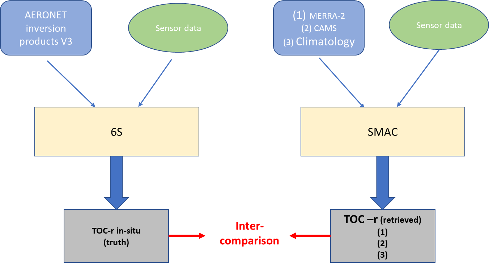{width="5.409448818897638in" height="2.952755905511811in"}

Figure : Validation methodology logic

::: {.content-visible when-format="docx"}
{width="5.8125in" height="3.1775317147856517in"}
:::

::: {.content-visible when-format="pdf"}
*(Figure omitted in PDF export: original diagram is a Windows EMF vector graphic not convertible in this environment; see the DOCX version of this ATBD for the figure.)*
:::

Table : List of AERONET sites used for validation

# Uncertainty Analysis Following FIDUCEO Approach

## Primary Measurement Equation

The TOC directional reflectance for each spectral band j is obtained through the SMAC atmospheric correction:

+-----------------------------------------------------------------------------------------------------------------------------------------------------------------------------------------------------+
|                                                                                                                                                                                                     |
+:===================================================================================================================================================================================================:+
| $$R_{toc}\left( \theta_{s},\theta_{v},\Delta\Phi \right) = f\left( R_{toa},T_{g},T_{sca},R_{atm},s_{atm};U_{H_{2}O},U_{O_{3}},P_{s},\tau_{a}^{550},aerosol\_ model \right) + \varepsilon_{0}$$ (18) |
+-----------------------------------------------------------------------------------------------------------------------------------------------------------------------------------------------------+

------------------------------------------------------------------------

Where:

\- **R~toc~**: Top-of-Canopy directional reflectance (output)

\- **R~toa~**: Top-of-Atmosphere reflectance (primary input)

\- **T~g~**: Total gaseous transmission

\- **T~sca~**: Atmospheric scattering transmission

\- **R~atm~**: Atmospheric path reflectance

\- **s~atm~**: Atmospheric spherical albedo

\- **U~H₂O~**: Total column water vapor (auxiliary input from MERRA-2)

\- **U~O₃~**: Total column ozone (auxiliary input from MERRA-2)

\- **P~s~**: Surface pressure (derived from DEM and MERRA-2 SLP)

\- **τ~a~⁵⁵⁰**: Aerosol optical thickness at 550 nm (auxiliary input from MERRA-2)

\- **aerosol model**: Selected aerosol optical properties

\- **ε₀**: Second-order uncertainty terms

## Primary Uncertainty Equation

The total TOC reflectance uncertainty is derived from the measurement equation through uncertainty propagation:

+---------------------------------------------------------------------------------------------------------------------------------------------------------------------------------------------------------------------------------------------------------------------------------------------------------------------------------------------------------------+
|                                                                                                                                                                                                                                                                                                                                                               |
$$
u\left( R_{toc}^{j} \right) = \sqrt{
\left( \frac{\partial R_{toc}^{j}}{\partial R_{toa}^{j}}u(R_{toa}^{j}) \right)^{2}
+ \left( \frac{\partial R_{toc}^{j}}{\partial U_{H_2O}}u(U_{H_2O}) \right)^{2}
+ \left( \frac{\partial R_{toc}^{j}}{\partial U_{O_3}}u(U_{O_3}) \right)^{2}
+ \left( \frac{\partial R_{toc}^{j}}{\partial P_{S}}u(P_{S}) \right)^{2}
+ \left( \frac{\partial R_{toc}^{j}}{\partial \tau_{a}^{550}}u\left( \tau_{a}^{550} \right) \right)^{2}
+ \left( u\left( R_{toc}^{j} \right)_{ensemble} \right)^{2}
+ \left( u\left( R_{toc}^{j} \right)_{RTM} \right)^{2}
} + u^{2}(0)
\qquad (19)
$$

------------------------------------------------------------------------

Where individual contributions include:

- **TOA reflectance uncertainty** (from Level 1C, propagated with analytical Jacobians)
- **Gaseous absorption uncertainties** (O₃, H₂O, propagated with analytical Jacobians)
- **Surface pressure uncertainty** (from DEM + geolocation, propagated with finite difference)
- **Aerosol optical depth uncertainty** (from MERRA-2 validation studies, propagated with finite difference)
- **Aerosol model uncertainty** (from AMIP ensemble spread)
- **Radiative transfer approximation errors** (SMAC vs. exact RT, terrain slope, adjacency...)
- Second-order effects (u²(0) term)

## Effects Tables (FIDUCEO Methodology)

Following Popp and Mittaz (2022), each uncertainty source is characterized through "effects tables" documenting:

- Affected term in measurement equation

- Maturity of uncertainty estimate (0=none to 3=rigorous)

- Correlation structure (type and scale, spatial and temporal)

- PDF shape and magnitude

- Sensitivity coefficients

### Effect 1: TOA Reflectance Uncertainty

+------------------------------+----------------------------------+----------------------------------------------+
| Descriptor                   | Value                            | Notes                                        |
+:=============================+:=================================+:=============================================+
| Name                         | Direct TOA reflectance inversion |                                              |
+------------------------------+----------------------------------+----------------------------------------------+
| Affected term                | R~toc~ = f(R~toa~)               |                                              |
+------------------------------+----------------------------------+----------------------------------------------+
| Maturity                     | 3 - Rigorous analysis            | Direct propagation with analytical Jacobians |
+------------------------------+----------------------------------+----------------------------------------------+
| Correlation type             | From Level 1C product            | Random, structured, common components        |
+------------------------------+----------------------------------+----------------------------------------------+
| Correlation scale (spatial)  | Pixel-dependent                  | Structured: scan-line or column correlations |
+------------------------------+----------------------------------+----------------------------------------------+
| Correlation scale (temporal) | Scene-independent                | Random component uncorrelated                |
+------------------------------+----------------------------------+----------------------------------------------+
| PDF shape                    | Gaussian                         | Assumed from calibration analysis            |
+------------------------------+----------------------------------+----------------------------------------------+
| Magnitude                    | DTOA-r from L1C                  | Band-dependent, typically 0.01-0.03          |
+------------------------------+----------------------------------+----------------------------------------------+
| Sensitivity                  | c₁ = ∂R~toc~/∂R~toa~ = η²·T      | Analytical Jacobian from SMAC                |
+------------------------------+----------------------------------+----------------------------------------------+

Table TOA reflectance uncertainty summary

### Effect 2: Ozone Column Uncertainty

+------------------------------+-----------------------------------------+-------------------------------------------------------------+
| Descriptor                   | Value                                   | Notes                                                       |
+:=============================+:========================================+:============================================================+
| Name                         | Total column ozone uncertainty          |                                                             |
+------------------------------+-----------------------------------------+-------------------------------------------------------------+
| Affected term                | R~toc~ = f(U~O₃~) via T~g~              |                                                             |
+------------------------------+-----------------------------------------+-------------------------------------------------------------+
| Maturity                     | 3 - Based on literature                 | MERRA-2 validation studies                                  |
+------------------------------+-----------------------------------------+-------------------------------------------------------------+
| Correlation type             | Structured (regional synoptic patterns) |                                                             |
+------------------------------+-----------------------------------------+-------------------------------------------------------------+
| Correlation scale (spatial)  | \~500 km                                | Synoptic weather systems                                    |
+------------------------------+-----------------------------------------+-------------------------------------------------------------+
| Correlation scale (temporal) | \~3 days                                | Weather pattern persistence                                 |
+------------------------------+-----------------------------------------+-------------------------------------------------------------+
| PDF shape                    | Gaussian                                |                                                             |
+------------------------------+-----------------------------------------+-------------------------------------------------------------+
| Magnitude                    | 6% of UO₃ value                         | From Wargan et al. (2017), Davis et al. (2017)              |
+------------------------------+-----------------------------------------+-------------------------------------------------------------+
| Sensitivity                  | c₂ = ∂R~toc~/∂U~O₃~                     | Analytical: ∂R~toc~/∂U~O₃~ = ∂R~toc~/∂T~O₃~ · ∂T~O₃~/∂U~O₃~ |
+------------------------------+-----------------------------------------+-------------------------------------------------------------+

Table : Ozone uncertainty summary

### Effect 3: Water Vapor Column Uncertainty

+------------------------------+--------------------------------------+--------------------------------------------+
| Descriptor                   | Value                                | Notes                                      |
+:=============================+:=====================================+:===========================================+
| Name                         | Total column water vapor uncertainty |                                            |
+------------------------------+--------------------------------------+--------------------------------------------+
| Affected term                | R~toc~ = f(U~H₂O~) via T~g~          |                                            |
+------------------------------+--------------------------------------+--------------------------------------------+
| Maturity                     | 2 - Estimated from literature        | MERRA-2 assessment                         |
+------------------------------+--------------------------------------+--------------------------------------------+
| Correlation type             | Structured (weather fronts)          |                                            |
+------------------------------+--------------------------------------+--------------------------------------------+
| Correlation scale (spatial)  | \~200 km                             | Convective systems                         |
+------------------------------+--------------------------------------+--------------------------------------------+
| Correlation scale (temporal) | \~1 day                              | Rapid atmospheric changes                  |
+------------------------------+--------------------------------------+--------------------------------------------+
| PDF shape                    | Gaussian                             |                                            |
+------------------------------+--------------------------------------+--------------------------------------------+
| Magnitude                    | 20% of U~H₂O~ value                  | Conservative estimate (Davis et al., 2017) |
+------------------------------+--------------------------------------+--------------------------------------------+
| Sensitivity                  | c₃ = ∂R~toc~/∂U~H₂O~                 | Analytical (same form as ozone)            |
+------------------------------+--------------------------------------+--------------------------------------------+

Table : Water vapor uncertainty summary

### Effect 4: Surface Pressure Uncertainty {#effect-4-surface-pressure-uncertainty-1}

The uncertainty on the surface pressure $P_{S}$ is due to the uncertainty on the meteorological sea level pressure P~0~ from MERRA-2 SLP parameter (very low, \<1 hPa), and the way the extrapolation to the altitude of the surface z is done. z is obtained through GTOPO30 elev, which has a resolution close to the targeted satellite product. The uncertainty in the mean altitude of the pixel is ∆*z*.

The surface pressure *P~s~* is derived as:

+----------+--------------------------------------------------+----------+
|          | $$P_{S} = P_{0}\ e^{- \frac{g}{r\lambda}T^{'}}$$ | \(20\)   |
+==========+:=================================================+:=========+
|          | $$T^{'} = \ln(rT) - \ln(rT - r\lambda z)$$       | \(21\)   |
+----------+--------------------------------------------------+----------+

*Where T is the temperature above ground (from MERRA-2 T10M parameter), g* is Earth's gravity (9.80665 m.s^−2^), *r* is the gas constant for dry air (287.058 J.kg^−1^.K^−1^) and λ is the lapse rate *of the atmosphere, here taken* as −0.006 K.m^−1^ (*Van Besselaar et al., 2011*). The accuracy of this model depends on the variability of λ (typically ∆λ = 0.002 K.m^−1^). An uncertainty of $\mathrm{\Delta}_{P_{s}}^{\lambda}$\~1hPa could be assigned to this modeling error.

However, the uncertainty in the geolocation could result in a significant uncertainty ∆z, especially in rough terrain. The latter error could be partly a random error and a pixel dependent bias.

For example, if the geolocation error is purely random and isotropic, with a stable standard deviation, one may pre-calculate the standard deviation of the surface altitude as shown in Figure 2.

+---------------------------------------------------------------------------------------------------------------------------------------------------------------------------------------------------------------------------------------------------------------------------------------------------------------------------------------------------------------------------------------------------------------------------+
|                                                                                                                                                                                                                                                                                                                                                                                                                           |
+:==========================================================================================================================================================================================================================================================================================================================================================================================================================+
| 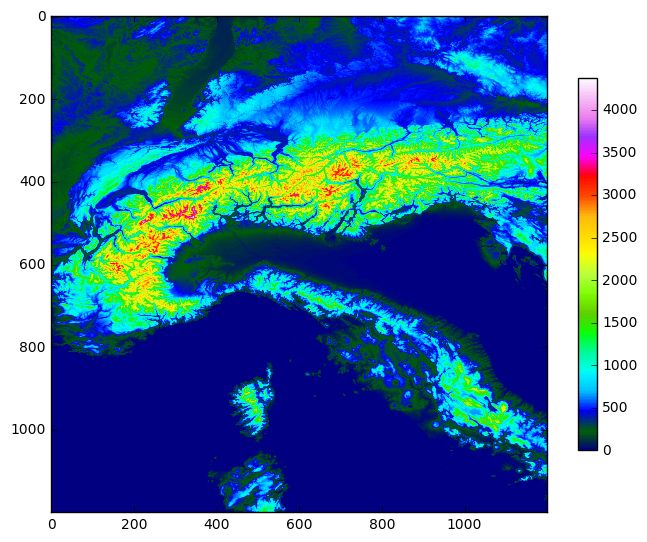{width="2.893700787401575in" height="2.425196850393701in"} 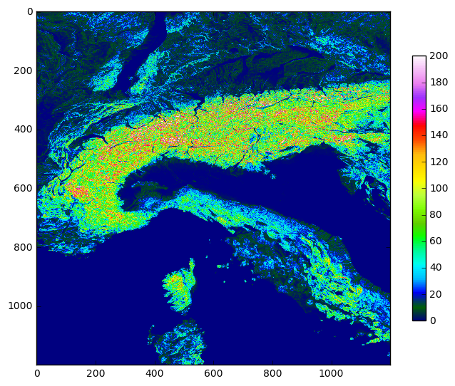{width="2.8976377952755907in" height="2.4606299212598426in"} |
+---------------------------------------------------------------------------------------------------------------------------------------------------------------------------------------------------------------------------------------------------------------------------------------------------------------------------------------------------------------------------------------------------------------------------+

------------------------------------------------------------------------

Figure 2: Surface elevation (left) and local standard deviation of altitude (right), both in m, from GTOPO30.

We implemented the computation of the local standard deviation of the surface altitude as an experimental auxiliary dataset within the DEM NetCDF file. The dataset named Delev has been computed from the convolution of elev with a gaussian averaging kernel with a parameter $\sigma$ = 0.5 (in GTOPO30 bin unit, e.g 30 arc second). This correpsonds to the geometric accuracy of SPOT/VGT (0.3 pixel)

Finally, the uncertainty on P~s~ is:

+---------------------------------------------------------------------------------------------------------------------------------------------------------------+
|                                                                                                                                                               |
+:=============================================================================================================================================================:+
| $$u(P_{s}) = \sqrt{\left\lbrack \left( \mathrm{\Delta}_{P_{s}}^{\lambda} \right)^{2} + \left( \mathrm{\Delta}_{P_{s}}^{z} \right)^{2} \right\rbrack/2}$$ (22) |
+---------------------------------------------------------------------------------------------------------------------------------------------------------------+

------------------------------------------------------------------------

with

+--------------------------------------------------------------------------+
|                                                                          |
+:========================================================================:+
| $$\mathrm{\Delta}_{P_{s}}^{z} = \left| J_{P_{s}}^{z}.u(z) \right|$$ (23) |
+--------------------------------------------------------------------------+

------------------------------------------------------------------------

and

|                                                            |
|:----------------------------------------------------------:|
| $$J_{P_{s}}^{z} = - \frac{gP_{S}}{r(T - \lambda z)}$$ (24) |

------------------------------------------------------------------------

+------------------------------+------------------------------------------------------------------------------------------+--------------------------------------------------------------------------------------+
| Descriptor                   | Value                                                                                    | Notes                                                                                |
+:=============================+:=========================================================================================+:=====================================================================================+
| Name                         | Surface pressure uncertainty                                                             |                                                                                      |
+------------------------------+------------------------------------------------------------------------------------------+--------------------------------------------------------------------------------------+
| Affected term                | Rtoc = f(Ps) via Rayleigh scattering                                                     |                                                                                      |
+------------------------------+------------------------------------------------------------------------------------------+--------------------------------------------------------------------------------------+
| Maturity                     | 3 - Rigorous propagation                                                                 | From DEM + meteorological uncertainty                                                |
+------------------------------+------------------------------------------------------------------------------------------+--------------------------------------------------------------------------------------+
| Correlation type             | Mixed: meteorological (common) + elevation (structured)                                  |                                                                                      |
+------------------------------+------------------------------------------------------------------------------------------+--------------------------------------------------------------------------------------+
| Correlation scale (spatial)  | Meteo: global; Elev: DEM resolution                                                      |                                                                                      |
+------------------------------+------------------------------------------------------------------------------------------+--------------------------------------------------------------------------------------+
| Correlation scale (temporal) | Meteo: \>1 month; Elev: permanent                                                        |                                                                                      |
+------------------------------+------------------------------------------------------------------------------------------+--------------------------------------------------------------------------------------+
| PDF shape                    | Gaussian                                                                                 |                                                                                      |
+------------------------------+------------------------------------------------------------------------------------------+--------------------------------------------------------------------------------------+
| Magnitude                    | u(Ps) = √\[($\mathrm{\Delta}_{P_{s}}^{\lambda}$)² + ($\mathrm{\Delta}_{P_{s}}^{z}$)²\]/2 | $\mathrm{\Delta}_{P_{s}}^{\lambda}$ \~1 hPa, $\mathrm{\Delta}_{P_{s}}^{z}$from Delev |
+------------------------------+------------------------------------------------------------------------------------------+--------------------------------------------------------------------------------------+
| Sensitivity                  | c₄ = ∂Rtoc/∂Ps                                                                           | Finite difference: δPs = 10 hPa                                                      |
+------------------------------+------------------------------------------------------------------------------------------+--------------------------------------------------------------------------------------+

Table : Surface pressure uncertainty summary

> **Critical Implementation Note (v1.1):** the computation of $T^{'} = \ln(rT) - \ln(rT - r\lambda z)$ overflows in float16 for typical temperatures ($T \approx 290$ K, $rT \approx 83246$, which exceeds the float16 maximum of 65504), producing NaN pressure and NaN Rtoc. The implementation therefore stores and processes `SLP` and `T10M` as **float32** in the ancillary cache (`_MERRA_CACHE_FLOAT32_VARS = {'SLP', 'T10M'}`). See Appendix D.2 for details.

### Effect 5: Aerosol Optical Depth Uncertainty

Quantifying aerosol optical depth (AOD) uncertainty in global chemical transport models (CTMs) remains critical for climate and air quality applications. Recent studies have highlighted systematic biases and uncertainties in leading reanalysis products such as CAMS and MERRA-2.

Comparative validation studies against AERONET ground-based observations reveal that both CAMS and MERRA-2 exhibit regional biases, with typical AOD uncertainties ranging from 30-50% depending on aerosol type and geographic location. Model-observation discrepancies are particularly pronounced over dust-dominated regions and biomass burning areas, where AOD can be underestimated by factors of 1.5-2.0.

Advances in uncertainty quantification have emerged through ensemble approaches and data assimilation techniques. Studies show that assimilating satellite retrievals can reduce AOD uncertainty by 20-35%, though systematic errors in aerosol vertical distribution persist. Emission inventory uncertainties, particularly for anthropogenic sources in rapidly developing regions, can account for 25-40% of total AOD uncertainty.

The community is moving toward probabilistic frameworks that explicitly quantify measurement uncertainties, model uncertainties, and structural uncertainties arising from parameterization choices in aerosol microphysics, chemistry, and removal processes.

The AOD uncertainties (Root Mean Square Errors) could be assigned on a regional scale using a climate type classification map like the one used in Gueymard and Yang 2020. Years of AOD \@550 and Angström exponent 3-hourly datasets from MERRA-2 and CAMS have been evaluated at 793 AERONET stations. The validation was conducted based on continents and Köppen-Geiger classification (see Figure 3).

+-----------------------------------------------------------------------------------------------------------------------------------------------------------+
|                                                                                                                                                           |
+:==========================================================================================================================================================+
| 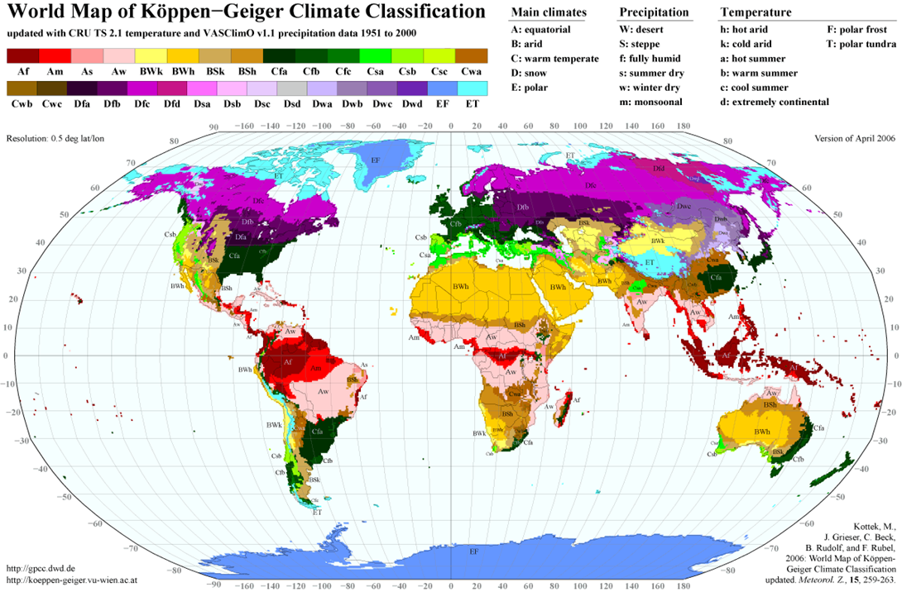{width="5.479861111111111in" height="3.6in"} |
+-----------------------------------------------------------------------------------------------------------------------------------------------------------+

------------------------------------------------------------------------

Figure : Map of Köppen-Geiger climate classification

#### RMSE Model

Based on the Gueymard and Yang findings, a practical operational uncertainty predictor can be formulated as:

$$\sigma\left( \tau_{a}^{550} \right) = \max\left( \sigma_{base},\sigma_{relative} \times \tau_{a}^{550} \right)$$

Where:

\- σ~base~ = 0.03 (clean atmosphere baseline)

\- σ~relative~ = 0.15 (15% relative uncertainty)

This is justified by the following arguments

\- Low AOD regime (τ~a~ \< 0.2): Dominated by instrument noise \~0.03

\- Moderate-high AOD (τ~a~ ≥ 0.2): Scales with aerosol loading → 15% uncertainty

We intend in an **updated version** to apply Köppen-Geiger climate classification multipliers:

+----------------------+----------------+----------------------------+
| Region Type          | Multiplier     | Example Locations          |
+:=====================+:===============+:===========================+
| Oceanic/Polar        | 0.7×           | Open oceans, Arctic        |
+----------------------+----------------+----------------------------+
| North America/Europe | 1.0×           | Baseline reference         |
+----------------------+----------------+----------------------------+
| Dust-dominated       | 1.5×           | Sahara, Arabian Peninsula  |
+----------------------+----------------+----------------------------+
| Biomass burning      | 1.4×           | Amazon, Sub-Saharan Africa |
+----------------------+----------------+----------------------------+
| High pollution       | 1.3×           | East Asia, South Asia      |
+----------------------+----------------+----------------------------+

+------------------------------+--------------------------------------------------------------------------------------+-------------------------------------+
| Descriptor                   | Value                                                                                | Notes                               |
+:=============================+:=====================================================================================+:====================================+
| Name                         | AOD at 550 nm uncertainty                                                            |                                     |
+------------------------------+--------------------------------------------------------------------------------------+-------------------------------------+
| Affected term                | Rtoc = f(τ~a~⁵⁵⁰)                                                                    |                                     |
+------------------------------+--------------------------------------------------------------------------------------+-------------------------------------+
| Maturity                     | 3 - Based on comprehensive validation                                                | Gueymard & Yang (2020) study        |
+------------------------------+--------------------------------------------------------------------------------------+-------------------------------------+
| Correlation type             | Structured (aerosol transport patterns)                                              |                                     |
+------------------------------+--------------------------------------------------------------------------------------+-------------------------------------+
| Correlation scale (spatial)  | Regional (\~200-500 km)                                                              | Aerosol plume extent                |
+------------------------------+--------------------------------------------------------------------------------------+-------------------------------------+
| Correlation scale (temporal) | \~1 week                                                                             | Aerosol lifetime                    |
+------------------------------+--------------------------------------------------------------------------------------+-------------------------------------+
| PDF shape                    | Skewed Gaussian (log-normal for high AOD)                                            |                                     |
+------------------------------+--------------------------------------------------------------------------------------+-------------------------------------+
| Magnitude                    | σ(τ~a~⁵⁵⁰) = max(0.03, 0.15×τ~a~⁵⁵⁰), and optionally regional multipliers (see text) | Based on Gueymard & Yang validation |
+------------------------------+--------------------------------------------------------------------------------------+-------------------------------------+

Table AOD550 uncertainty summary

### Effect 6: Aerosol Model Selection Uncertainty

The SMAC coefficients are computed by an in-house radiative transfer model depending on the aerosol mixture (see section 9)

- X~u~ = $\frac{\tau_{a;u}^{550}}{\tau_{a}^{550}}$ \[u $\in \{ DU,BC,OC,SE,SU\}\rbrack$ from MERRA-2

- iaero = $\text{argmin}_i \sum_{u} \left( X_u - X_{u,i} \right)^{2}$, for $i=0,\ldots,147$ (currently one model selected)

- The X~u,i~ basis for the 148 predefined models are stored in a text file and read once.

So, it is possible simply to choose a couple of aerosol models that fit best with the MERRA-2 data and run SMAC-CL on an ensemble of models. We rely here on the AMIP dataset (see section 2.4) that yields an ensemble of 10 aerosols models globally monthly. An example is given in Figure 4 .

+-------------------------------------------------------------------------------------------------------------------------------------------------------------------------------------------------------------+
|                                                                                                                                                                                                             |
+:============================================================================================================================================================================================================+
| 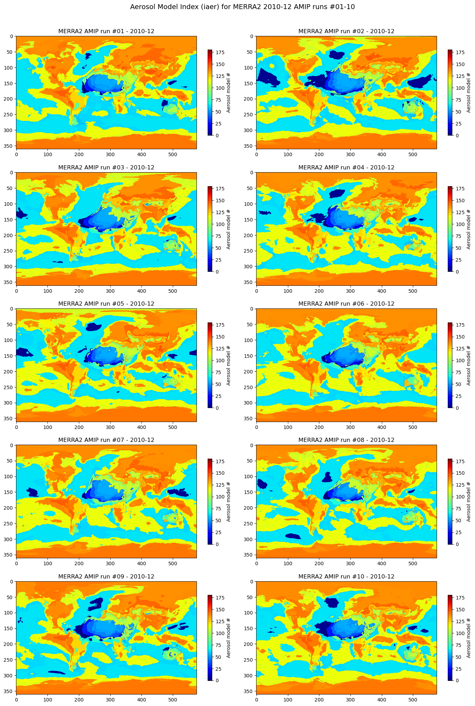{width="5.0078740157480315in" height="7.437007874015748in"} |
+-------------------------------------------------------------------------------------------------------------------------------------------------------------------------------------------------------------+

------------------------------------------------------------------------

Figure : SMAC Aerosol model index (0-147) reconstructed from the AMIP ensemble runs #1-10 for December 2010

+------------------------------+---------------------------------------------------------------------+------------------------+
| Descriptor                   | Value                                                               | Notes                  |
+:=============================+:====================================================================+:=======================+
| Name                         | Aerosol optical properties (model type)                             |                        |
+------------------------------+---------------------------------------------------------------------+------------------------+
| Affected term                | Rtoc = f(aerosol_model)                                             |                        |
+------------------------------+---------------------------------------------------------------------+------------------------+
| Maturity                     | 2 - Ensemble approach                                               | AMIP 10-member spread  |
+------------------------------+---------------------------------------------------------------------+------------------------+
| Correlation type             | Structured (regional aerosol regimes)                               |                        |
+------------------------------+---------------------------------------------------------------------+------------------------+
| Correlation scale (spatial)  | \~100 km (1° grid)                                                  | Climatology resolution |
+------------------------------+---------------------------------------------------------------------+------------------------+
| Correlation scale (temporal) | \~1 week                                                            | Aerosol type changes   |
+------------------------------+---------------------------------------------------------------------+------------------------+
| PDF shape                    | Empirical (ensemble spread)                                         |                        |
+------------------------------+---------------------------------------------------------------------+------------------------+
| Magnitude                    | u_Rtoc_ensemble = std(Rtoc_j), j=1..10                              | From AMIP runs         |
+------------------------------+---------------------------------------------------------------------+------------------------+
| Sensitivity                  | Implicit in ensemble                                                | No explicit Jacobian   |
+------------------------------+---------------------------------------------------------------------+------------------------+
|                              | `For each pixel:`\                                                  |                        |
|                              | `1. Select 10 preferred aerosol models from 148 options`\           |                        |
|                              | `(based on MERRA-2 species fractions matching AMIP ensemble)`\      |                        |
|                              | `2. Run SMAC with each model → Rtoc,1 ... Rtoc,10`\                 |                        |
|                              | ``` 3. ``u_Rtoc_ensemble`` = ``standard_deviation``(``Rtoc,j``) ``` |                        |
+------------------------------+---------------------------------------------------------------------+------------------------+

Table : Aerosol model uncertainty summary

### Effect 7: Radiative Transfer Approximations

Three sources of RT approximation errors:

#### 7a. Lambertian Surface Assumption

It is most important for NIR and strong aerosol loading (in that case uncertainty due to AOD dominating). The modelling of the effect and a way to estimate the uncertainty associated is described in section 8.5. The surface BRDF shape is modeled using two parameters ${\ k}_{1}^{p}$ and $k_{2}^{p}$, depending on spectral band.

In the baseline run, the surface is supposed to be lambertian (in that case${\ k}_{1}^{p} = k_{2}^{p} = 0$). In a second run, those two parameters are assigned a climatological value, for example coming from the C3S Multi Sensor Surface Albedo products k~0~, k~1~ and k~2~ with $k_{1}^{p} = \ \frac{k_{1}}{k_{0}}\ ;\ k_{2}^{p} = \ \frac{k_{2}}{k_{0}}$

Difference in R~toc~ from the two runs gives an estimation of the BRDF effects.

$u\left( R_{toc}^{j} \right)_{RTM\_BRDF} = \left( {\ k}_{1}^{p}=0,k_{2}^{p} =0 \right) - \left( {\ k}_{1}^{p} \neq 0, k_{2}^{p} \neq 0 \right)$
+--------------+----------------------------------------------------------------------------------------------------------------------------------------------------------------------+-------------------------------------+
| Descriptor   | Value                                                                                                                                                                | Notes                               |
+:=============+:=====================================================================================================================================================================+:====================================+
| Significance | Moderate (NIR, high AOD)                                                                                                                                             |                                     |
+--------------+----------------------------------------------------------------------------------------------------------------------------------------------------------------------+-------------------------------------+
| Maturity     | 1 - Initial assessment                                                                                                                                               | From 6S validation                  |
+--------------+----------------------------------------------------------------------------------------------------------------------------------------------------------------------+-------------------------------------+
| Magnitude    | \~1% for most cases                                                                                                                                                  | Up to 5% for strong BRDF + high AOD |
+--------------+----------------------------------------------------------------------------------------------------------------------------------------------------------------------+-------------------------------------+
| Mitigation   | Using BRDF shape included in the product (https://dast.copernicus-climate.eu/documents/satellite-albedo/D1.3.4-v2.0_ATBD_CDR_SA_MULTI_SENSOR_v2.0_PRODUCTS_v1.1.pdf) |                                     |
+--------------+----------------------------------------------------------------------------------------------------------------------------------------------------------------------+-------------------------------------+

Table : RTM Lambertian assumption uncertainty summary

#### 7b. Terrain Slope Effects

Mountain areas, rough terrain, have been modelled and estimated through a simple model following [cesbio](https://www.cesbio.cnrs.fr/multitemp/2481/) (https://www.cesbio.cnrs.fr/multitemp/2481/)

The slope_eff function computes the terrain-induced relative effect. Here are the mathematical equations:

[Input Variables:]{.underline}

- $\theta_{s}$ : Solar Zenith Angle (SZA)

- $\phi_{s}$ : Solar Azimuth Angle (SAA)

- $s$ : Terrain slope (computed from DEM using xdem python package)

- $\phi_{a}$ : Terrain aspect (computed from DEM using xdem python package)

[Derived Quantities:]{.underline}

- Cosine of solar zenith angle:

$$\mu_{s} = cos\left( \theta_{s} \right)$$

- Cosine of terrain slope:

$$\mu = cos(s)$$

- Effective cosine of incidence angle on tilted surface:

$$\mu_{i} = \mu_{s} \cdot \mu + \sqrt{1 - \mu_{s}^{2}} \cdot \sqrt{1 - \mu^{2}} \cdot cos\left( \phi_{s} - \phi_{a} \right)$$

- Sky view factor:

$$f_{sky} = \frac{1 + \mu}{2}$$

- Ground view factor:

$$f_{ground} = \frac{1 - \mu}{2}$$

- Slope Error

$$slope_{eff} = \frac{T}{T_{dir} \cdot \frac{\mu_{i}}{\mu_{s}} + T_{dif} \cdot f_{sky} + T \cdot f_{ground} \cdot \rho_{env}}$$

- ${u\left( R_{toc}^{j} \right)}_{RTM - slope} = R_{toc}^{j}*(slope_{eff} - 1)$

Where:

$T$ : Total atmospheric transmittance (an output of the SMAC function)

$T_{dir}$ : Direct atmospheric transmittance (an output of the SMAC function)

$T_{dif}$ : Diffuse atmospheric transmittance (an output of the SMAC function)

$\rho_{env}:$ Average environment reflectance, (supposed here equal to pixel ground reflectance)

+--------------+-----------------------------------------+-------------------------------------+
| Descriptor   | Value                                   | Notes                               |
+:=============+:========================================+:====================================+
| Significance | Moderate to High in mountainous regions |                                     |
+--------------+-----------------------------------------+-------------------------------------+
| Maturity     | 1 - Initial assessment                  | From CESBIO simple model (see text) |
+--------------+-----------------------------------------+-------------------------------------+
| Magnitude    | Several %                               | Could be 40%                        |
+--------------+-----------------------------------------+-------------------------------------+
| Mitigation   | Simple model                            | From CESBIO simple model (see text) |
+--------------+-----------------------------------------+-------------------------------------+

Table : RTM terrain effect uncertainty summary

#### 7c. SMAC Polynomial Fitting Errors

The estimation of the uncertainty due to the SMAC fitting errors is presented in section 8.4

+---------------+---------------------------------------+-------------------------------+
| Descriptor    | Value                                 | Notes                         |
+:==============+:======================================+:==============================+
| Significance  | Moderate                              |                               |
+---------------+---------------------------------------+-------------------------------+
| Maturity      | 3 - Quantified through RT comparisons |                               |
+---------------+---------------------------------------+-------------------------------+
| Magnitude     | \~1-10% RMSE vs. 6S                   | Validated with neural network |
+---------------+---------------------------------------+-------------------------------+

Table : SMAC fitting uncertainty summary

## Uncertainty Characterization Summary

### Input Uncertainty Estimates

Following the FIDUCEO approach, all input uncertainties are documented:

+--------------------+----------------------+----------------------+-----------------------------------------------------------+
| Input Parameter    | Source               | Uncertainty Estimate | Notes                                                     |
+:===================+:=====================+:=====================+:==========================================================+
| R~toa~             | Level 1C FDR         | From DTOA-r          | Band-dependent, separated into random/structured/common   |
+--------------------+----------------------+----------------------+-----------------------------------------------------------+
| UO₃                | MERRA-2 + literature | 6%                   | Wargan et al. (2017), Davis et al. (2017)                 |
+--------------------+----------------------+----------------------+-----------------------------------------------------------+
| UH₂O               | MERRA-2 + estimate   | 20%                  | Conservative, needs validation                            |
+--------------------+----------------------+----------------------+-----------------------------------------------------------+
| P₀                 | MERRA-2 SLP          | \<1 hPa              | Meteorological model uncertainty                          |
+--------------------+----------------------+----------------------+-----------------------------------------------------------+
| λ (lapse rate)     | Model assumption     | 0.002 K/m            | Van Besselaar et al. (2011)                               |
+--------------------+----------------------+----------------------+-----------------------------------------------------------+
| z (elevation)      | GTOPO30 + geoloc     | Delev (DEM stddev)   | Convolution with σ=0.5 pixels (\~0.3 VGT pixel)           |
+--------------------+----------------------+----------------------+-----------------------------------------------------------+
| τ~a~⁵⁵⁰            | MERRA-2 + validation | max(0.03, 0.15×τa)   | Gueymard & Yang (2020), regionalized                      |
+--------------------+----------------------+----------------------+-----------------------------------------------------------+
| Aerosol model      | AMIP ensemble        | Ensemble spread      | 10-member AMIP runs                                       |
+--------------------+----------------------+----------------------+-----------------------------------------------------------+
| RTM approximations | Modelling            | 1-30%                | Very scene dependent. Worst case: rough terrain, high AOD |
+--------------------+----------------------+----------------------+-----------------------------------------------------------+

### Correlation Structures

+---------------------+-----------------------+----------------------+-------------------------------------+
| Effect              | Spatial Correlation   | Temporal Correlation | Implementation                      |
+:====================+:======================+:=====================+:====================================+
| TOA-r (random)      | None                  | None                 | Average as √(Σu²)/N                 |
+---------------------+-----------------------+----------------------+-------------------------------------+
| TOA-r (structured)  | Scan-line or column   | None                 | Use L1C correlation matrix          |
+---------------------+-----------------------+----------------------+-------------------------------------+
| TOA-r (common)      | Global                | Global               | Simple average (no reduction)       |
+---------------------+-----------------------+----------------------+-------------------------------------+
| UO₃                 | \~500 km (synoptic)   | \~3 days             | Exponential decay                   |
+---------------------+-----------------------+----------------------+-------------------------------------+
| UH₂O                | \~200 km (convective) | \~1 day              | Exponential decay                   |
+---------------------+-----------------------+----------------------+-------------------------------------+
| Ps (meteorological) | Global                | \>1 month            | Common (no reduction)               |
+---------------------+-----------------------+----------------------+-------------------------------------+
| Ps (elevation)      | DEM resolution        | Permanent            | Structured (terrain-correlated)     |
+---------------------+-----------------------+----------------------+-------------------------------------+
| τ~a~⁵⁵⁰             | \~200-500 km (plume)  | \~1 week             | Exponential decay                   |
+---------------------+-----------------------+----------------------+-------------------------------------+
| Aerosol model       | 1° (climatology grid) | 1 week               | Rectangle function                  |
+---------------------+-----------------------+----------------------+-------------------------------------+
| RT approximations   | Scene-dependent       | None                 | Random or systematic (case-by-case) |
+---------------------+-----------------------+----------------------+-------------------------------------+

## Limitations and Future Improvements

### Known Limitations

Current Implementation:

- Surface BRDF: Simplified kernel model
  - Impact: Up to 10% error in directional reflectance over non-forest surfaces
- Terrain effect: Simplified model
- Water Vapor Uncertainty: Conservative 20% estimate
  - Impact: May overestimate total uncertainty in dry conditions
  - Future: Refined characterization from MERRA-2 validation studies
- Adjacency Effects: Not corrected
  - Impact: Significant for high-contrast scenes (coast, cloud edge)
  - Option: Implement semi-empirical adjacency correction

> **Status update (v1.1):** Adjacency effects remain a **confirmed known limitation** (not corrected in the operational chain). Köppen-Geiger regional AOD uncertainty multipliers (Section 5.3.5) remain a **planned feature**: the classification data (`kg_zoneNumGueymard.csv`) is available in ANCILLARY, but the regional multipliers are not yet applied in `compute_urtoc()`. See Appendix D.3 for details.

### Second-Order Effects (u²(0) term)

Effects considered minor and not explicitly propagated:

+-----------------------------------------+---------------------+------------------------------------+
| Effect                                  | Estimated Magnitude | Justification                      |
+:========================================+:====================+:===================================+
| Trace gas absorption (CO₂, CH₄, N₂O)    | \<0.001             | Window channel placement           |
+-----------------------------------------+---------------------+------------------------------------+
| Rayleigh scattering altitude dependence | \<0.002             | Accurate DEM + pressure correction |
+-----------------------------------------+---------------------+------------------------------------+
| LUT interpolation errors                | \<0.001             | Dense sampling validated vs. 6S    |
+-----------------------------------------+---------------------+------------------------------------+
| Aerosol hygroscopic growth              | \<0.005             | Implicit in fixed RH=80% model     |
+-----------------------------------------+---------------------+------------------------------------+
| Polarization                            | \<0.003             | Minor for broad-band sensors       |
+-----------------------------------------+---------------------+------------------------------------+
| Spectral band mismatch                  | \<0.002             | SMAC computed for actual RSR       |
+-----------------------------------------+---------------------+------------------------------------+

Table : Second order uncertainty summary

**Combined second-order**: u(0) ≈ 0.007 (added quadratically to total)

# Conclusions

This ATBD demonstrates a comprehensive implementation of the FIDUCEO uncertainty propagation methodology for atmospheric correction of satellite vegetation sensors. Key achievements:

- **Rigorous Uncertainty Quantification**: All major uncertainty sources are identified, characterized, and propagated through the measurement equation

- **Operational AOD Uncertainty Model**: Based on extensive MERRA-2 validation (Gueymard & Yang 2020), providing realistic AOD uncertainties: σ(τ~a~) = max(0.03, 0.15×τa) with regional adjustments

- **Ensemble Approach for Model Uncertainty**: AMIP 10-member ensemble quantifies aerosol optical property uncertainties

- **Efficient GPU Implementation**: SMAC-CL enables fast processing while computing full Jacobian matrices

- **Validation Framework**: Following Aerosol_cci and FIDUCEO best practices (Popp & Mittaz 2022)

This approach provides climate-quality TOC reflectances with fully traceable, metrologically sound uncertainties suitable for:

- Long-term surface monitoring

- Multi-sensor harmonization

- Climate model validation

# References

**FIDUCEO Methodology:**

\- Mittaz, J., Merchant, C.J., Woolliams, E.R. (2019). Applying principles of metrology to historical Earth observations from satellites. *Metrologia*, 56, 032002.

\- Popp, T., Mittaz, J. (2022). Systematic Propagation of AVHRR AOD Uncertainties---A Case Study to Demonstrate the FIDUCEO Approach. *Remote Sensing*, 14(4), 875.

**MERRA-2 Validation:**

\- Gueymard, C., Yang, D. (2020). Worldwide validation of CAMS and MERRA-2 reanalysis aerosol optical depth products using 15 years of AERONET observations. *Atmospheric Environment*, 225, 117216.

\- Wargan, K., et al. (2017). Evaluation of the Ozone Fields in NASA's MERRA-2 Reanalysis. *Journal of Climate*, 30, 2961-2988.

\- Davis, S.M., et al. (2017). Assessment of upper tropospheric and stratospheric water vapor and ozone in reanalyses. *Atmospheric Chemistry and Physics*, 17, 12743-12778.

**Atmospheric Correction:**

\- Rahman, H., Dedieu, G. (1994). SMAC: A simplified method for the atmospheric correction of satellite measurements in the solar spectrum. *International Journal of Remote Sensing*, 15, 123-143.

\- Vermote, E.F., et al. (1997). Second Simulation of the Satellite Signal in the Solar Spectrum (6S). *IEEE TGRS*, 35, 675-686.

**Aerosol Climatology:**

\- Kinne, S., et al. (2006). An AeroCom initial assessment---optical properties in aerosol component modules of global models. *Atmospheric Chemistry and Physics*, 6, 1815-1834.

**Surface Pressure:**

\- Van Besselaar, E.J.M., et al. (2011). A European daily high-resolution observational gridded data set of sea level pressure. *Journal of Geophysical Research*, 116, D11110.

\- Breon, F.-M., A. Vermeulen and J. Descloitres, An evaluation of satellite aerosol products against sunphotometer measurements, Remote Sensing of Environment, Volume **115**, Issue 12, pp 3102-3111, 2011. <https://doi.org/10.1016/j.rse.2011.06.017>.

\- Buchard, V., C.A. Randles, A.M. da Silva, A. Darmenov, P.R. Colarco, R. Govindaraju, R. Ferrare, J. Hair, A.J. Beyersdorf, L.D. Ziemba, and H. Yu, The MERRA-2 Aerosol Reanalysis, 1980 Onward. Part II: Evaluation and Case Studies. J. Climate, **30**, 6851--6872, 2017. <https://doi.org/10.1175/JCLI-D-16-0613.1>

\- Ramon D. and R. Santer, Operational remote sensing of aerosols over land to account for directional effects, Applied Optics-LP, **40**, 3060-3075 (2001).

\- Randles, C.A., A. M. da Silva, V. Buchard, P. R. Colarco, A. Darmenov, R. Govindaraju, A. Smirnov, B. Holben, R. Ferrare, J. Hair, Y. Shinozuka, and C. J. Flynn, The MERRA-2 Aerosol Reanalysis, 1980 Onward. Part I: System Description and Data Assimilation Evaluation. Journal of Climate **30**:17, 6823-6850, 2017.

Appendices

# Appendix A: SMAC Coefficient Calculation

## Spectral response functions and gaseous absorption

We give here typical atmospheric gaseous transmissions in the Proba-V spectral bands and the RSRF for the CENTER camera. All radiative transfer computations have also been done for LEFT and RIGHT cameras RSRF's

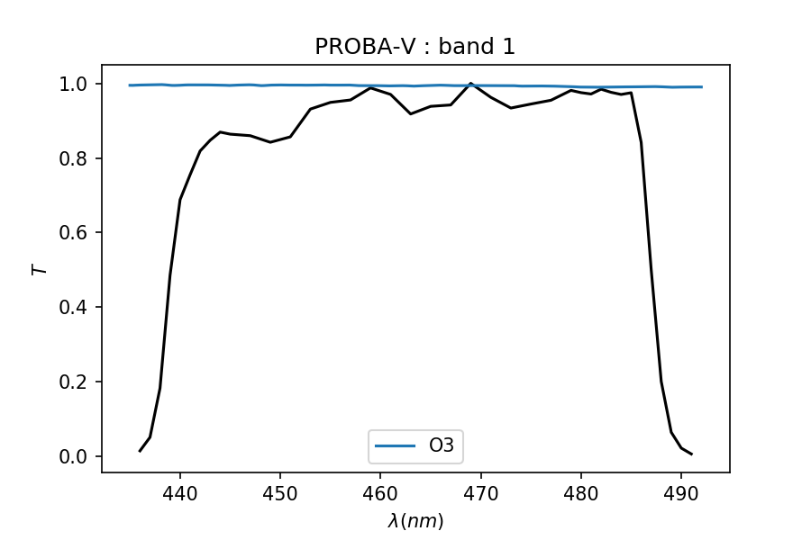{width="4.803149606299213in" height="3.2007874015748032in"}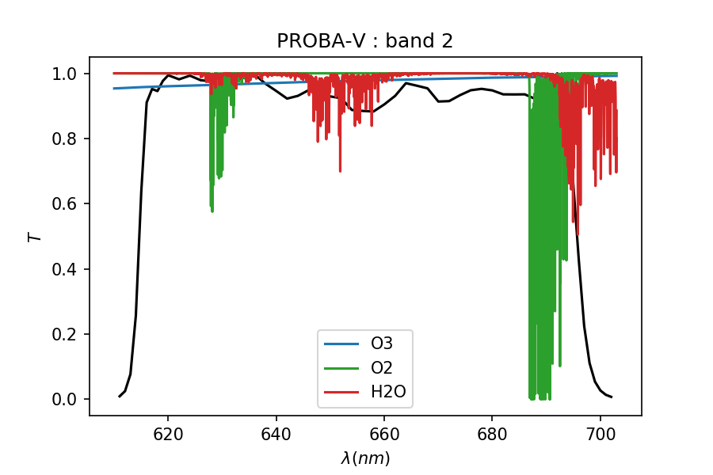{width="4.803149606299213in" height="3.2007874015748032in"}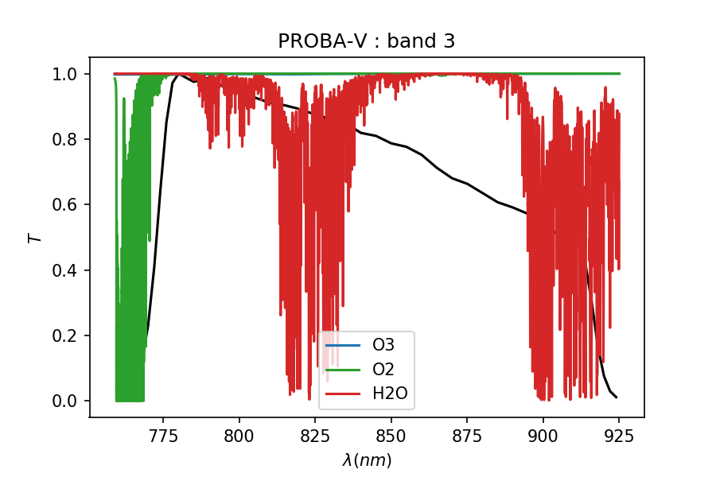{width="4.803149606299213in" height="3.2007874015748032in"}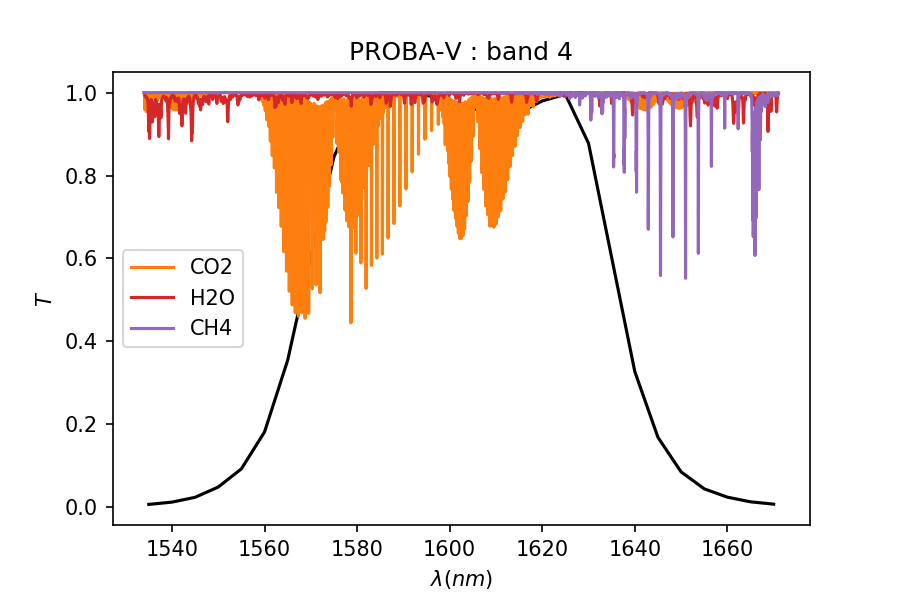{width="4.803149606299213in" height="3.2007874015748032in"}

## Processing chain

In Figure 5 is shown how SMAC coefficients are derived from basic data.

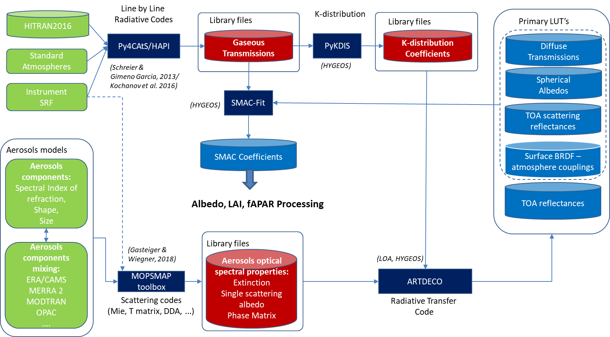{width="6.15625in" height="3.3991786964129482in"}

Figure 5 Organization of the radiative transfer tools at HYGEOS for computing atmospheric Look Up Tables from primary data

## Gaseous absorption modelling

With the RSRF data as described in the previous section, we computed the typical absorption based on the spectroscopic HITRAN 2012/2016 database (Gordon et al., 2017) and the line by line radiative transfer tools Py4Cats (Schreier et al., 2013) and/or HAPI (Kochanov et al., 2016). Then regression of gaseous transmission versus gas concentrations, air masses and barometric pressure (see Figure 6) were computed to yield SMAC coefficients fitting the gaseous absorption. Correlated K-distribution coefficients computed with the new tool PyKdis, developed by HYGEOS, are also obtained in this step, for further use in the simulation of real TOA radiances for both sensors.

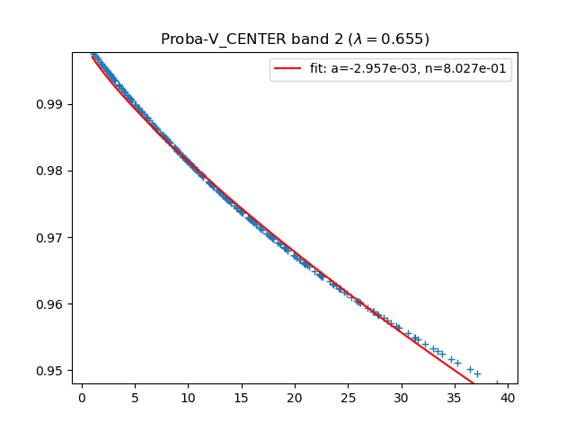{width="5.118055555555555in" height="3.8381944444444445in"}

Figure 6: Example of the fit of water vapor transmission in band 2 of Proba-V Center camera. SMAC fitting model is T = exp ( a . (m. U~H2O~)^n^), where m is the air mass and U~H2O~ is the water vapor column

## Radiative transfer computations and fit accuracy

Radiative transfer equation for each pixel (geometry, band, AOT, P~surf~) is solved independently using ARTDECO RT package (<http://www.icare.univ-lille1.fr/projects/artdeco>). The TOA reflectance computations are done for a black surface and no gaseous absorption to simulate scattering quantities used in 6S/SMAC, i.e.:

- TOA reflectance (ρ^toa^) for aerosols and Rayleigh mixing, Aerosols and Rayleigh only

- Total (direct + diffuse) Transmission

- Spherical albedo

For each band, those optical quantities are simulated for various geometries, surface pressure, aerosol optical thicknesses... For example, for the TOA reflectance:

- RAA: 121 values from 0 to 180°

- SZA : 38 values from 0 to 89° (but used only if \<70°)

- VZA: 47 values from 0 to 89° (but used only if \<70°)

- Surface pressure: 6 values from 600 to 1050 hPa

- AOT at 550 nm: 16 values from 0.01 to 1.5 (but used only if \< 0.8)

Several multi-dimensional fits are performed to give the SMAC model parameters of scattering quantities. An estimation of the quality of the fit is also obtained, giving the potential to estimate the radiative transfer modeling error (see Figure 7, Figure 8, Figure 9).

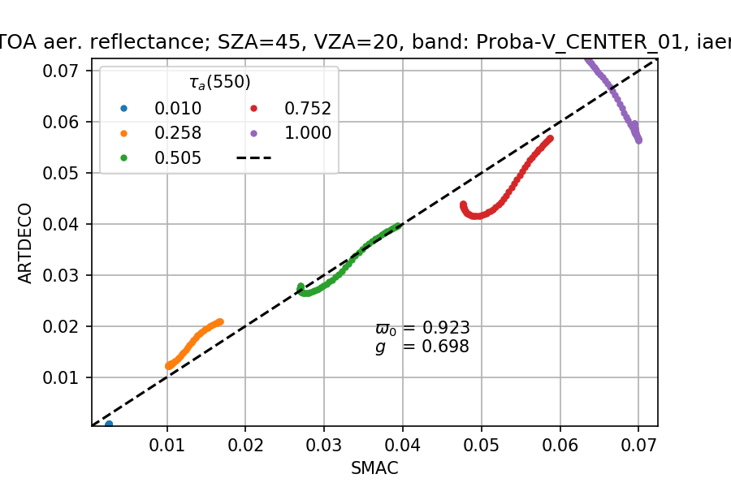{width="4.803149606299213in" height="3.2007874015748032in"}

Figure 7: Example of accuracy of the SMAC model compared to ARTDECO. Aerosol TOA reflectance for band 01 of Proba-V center camera for one SZA and VZA and for all azimuth, for AOT at 550 nm ranging from 0.01 to 1 and for the aerosol model #1. The fit was performed for all VZA \< 60, SZA \<70, AOT (550) \<0.76, all azimuths. The accuracy decreases above an AOT at 550 nm of \~ 0.5

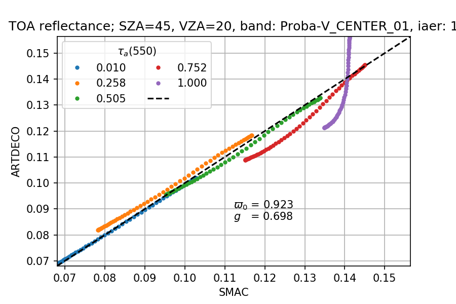{width="4.803149606299213in" height="3.2007874015748032in"}

Figure 8 : Same as Figure 7 but for TOA atmospheric reflectance.

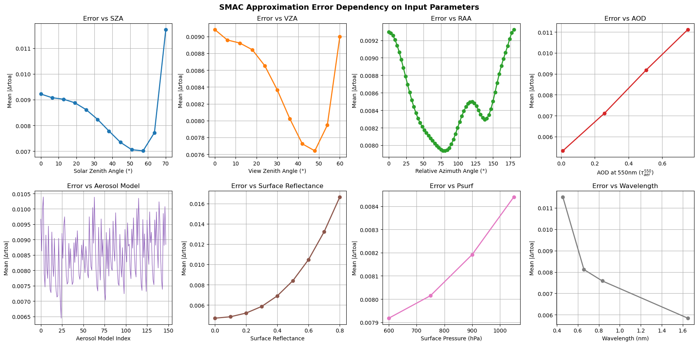{width="6.3in" height="3.1180555555555554in"}

Figure : Rtoa SMAC Fit mean accuracy as a function of the various inputs. Statistics are given for all the LUT nodes and AOT (550) \<0.76.

### References

Schreier, F., Gimeno García, S.; Hochstaffl, P., Städt, S., (2019) Py4CAtS---PYthon for Computational ATmospheric Spectroscopy. *Atmosphere*, ***10***, 262. https://doi.org/10.3390/atmos10050262

I. E. Gordon, L. S. Rothman, C. Hill, R. V. Kochanov, Y. Tan, *et al.*, (2017) The HITRAN2016 molecular spectroscopic database, *J. Quant. Spectrosc. Radiat. Transfer* **203**, 3-69 (2017)

R.V. Kochanov, I.E. Gordon, L.S. Rothman, P. Wcislo, C. Hill, J.S. Wilzewski (2016). HITRAN Application Programming Interface (HAPI): A comprehensive approach to working with spectroscopic data, *J. Quant. Spectrosc. Radiat. Transfer,* **177**, 15-30 (2016).

<https://hitran.org/hapi>

Hess, M.; Koepke, P. & Schult, I, (1998). Optical Properties of Aerosols and Clouds: The Software Package OPAC. *Bulletin of the American Meteorological Society*, 1998, **79**, 831-844

### Fit Uncertainty Model

This part aims to estimate the incertitude of the outputted reflectance of SMAC using lightweight and fast Neural Network. Those models will be exclusively Feed Forward Neural Network (also called MLP) and will be small to satisfy hardware constraint on memory usage.

The required library for the inference of ML model is ONNXRuntime. It is a library that optimizes and executes machine learning models in ONNX (Open Neural Network Exchange) format. In operational workflows, it enables fast, efficient model deployment by opening model as black-box function.

[Inputs]{.underline} :

- Angles (SZA, VZA, RAA)

- AOD at 550 nm

- Pression

- TOC-r

- iaer

- TOA-r

After using the SMAC coefficients simulations representing more than 106 points, we performed a test using a very fast pots processing pure python NN inference for one band. The test outcome, shown hereafter, is promising to show a Mean Square Error of 0.0097 on the predicted RTM uncertainty on R~toc~

> 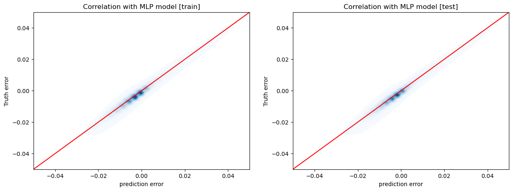{width="6.3in" height="2.3506944444444446in"}

## BRDF effect estimation

The baseline AC are run under the assumption of a lambertian surface. If the shape of the surface BRDF is known, we can optionally include this knowledge into the AC scheme with the following modelling

### Surface BRDF model (RossThick-LiSparse-R)

In the following, we restrict the description to a model with three parameters of the form:

+---------------------------------------------------------------------------------------------+
|                                                                                             |
+:============================================================================================+
| $\rho_{g}$*(θ~s~, θ~v~, ϕ) = k~0~ + k~1~F~1~(θ~s~, θ~v~, ϕ) + k~2~F~2~(θ~s~, θ~v~, ϕ)* (25) |
+---------------------------------------------------------------------------------------------+

------------------------------------------------------------------------

While *k~0~* quantifies an isotropic contribution to the reflectance factor *F~0~*=1, functions *F~1~* and *F~2~* represent the angular distribution related to geometric and volumetric surface scattering processes, respectively. Lucht et al. (2000) suggest the RossThick-LiSparse-Reciprocal model (simply referred to as the Ross-Li BRDF model) that results from the combination of two models for the definition of the volumetric (RossThick) and geometric (LiSparse-R) kernels. The geometric kernel is expressed as follows:

+--------------------------------------------------------------------------------------------------------------------------------------------------------------------------------------------------------------------------------------------------------------------------------------------------------+
|                                                                                                                                                                                                                                                                                                        |
+:=======================================================================================================================================================================================================================================================================================================+
| $$F_{1}\left( \theta_{s}{,\theta}_{v},\phi \right) = O\left( \theta_{s}{,\theta}_{v},\phi \right) - sec\left( {\theta\ '}_{s} \right) - sec\left( {\theta\ }_{v}^{'} \right) + \frac{1}{2}\left( 1 + cos(\xi\ ') \right)\sec\left( {\theta\ '}_{s} \right)\sec\left( {\theta\ }_{v}^{'} \right)$$ (26) |
+--------------------------------------------------------------------------------------------------------------------------------------------------------------------------------------------------------------------------------------------------------------------------------------------------------+

------------------------------------------------------------------------

Where,

+----------------------------------------------------------------------------------------------------------------------------------------------------------------------------------------------------------------------+---------+
| $$O = \frac{1}{\pi}\left( t - sin(t)\cos(t) \right)\left( \sec\left( \theta_{s}^{\ '} \right) - sec\left( \theta_{v}^{\ '} \right) \right)$$                                                                         | \(27\)  |
+:=====================================================================================================================================================================================================================+:========+
| $$\cos{(t) = 2}\frac{\sqrt{D^{2} + \left( \tan\left( \theta_{s}^{\ '} \right)\tan\left( \theta_{v}^{\ '} \right)\sin(\phi) \right)^{2}}}{\sec\left( \theta_{s}^{\ '} \right) + sec\left( \theta_{v}^{\ '} \right)}$$ | \(28\)  |
+----------------------------------------------------------------------------------------------------------------------------------------------------------------------------------------------------------------------+---------+
| $$D = \sqrt{\tan^{2}\left( \theta_{s}^{\ '} \right) + \tan^{2}\left( \theta_{v}^{\ '} \right) - 2tan\left( \theta_{s}^{\ '} \right)\tan\left( \theta_{v}^{\ '} \right)\cos(\phi)}$$                                  | \(29\)  |
+----------------------------------------------------------------------------------------------------------------------------------------------------------------------------------------------------------------------+---------+
| $$\cos\left( \xi^{\ '} \right) = cos\left( \theta_{s}^{\ '} \right)\cos\left( \theta_{v}^{\ '} \right) + sin\left( \theta_{s}^{\ '} \right)\sin\left( \theta_{v}^{\ '} \right)\cos(\phi)$$                           | \(30\)  |
+----------------------------------------------------------------------------------------------------------------------------------------------------------------------------------------------------------------------+---------+
| $\theta_{s}^{\ '} = \tan^{- 1}\left( \frac{b_{RL}}{r}\tan\theta_{s} \right)$ and $\theta_{v}^{\ '} = \tan^{- 1}\left( \frac{b_{RL}}{r}\tan\theta_{v} \right)$                                                        | \(31\)  |
+----------------------------------------------------------------------------------------------------------------------------------------------------------------------------------------------------------------------+---------+

And the volumetric kernel is defined as:

+---------------------------------------------------------------------------------------------------------------------------------------------------------------------------------------------------------+
|                                                                                                                                                                                                         |
+:========================================================================================================================================================================================================+
| $$F_{2}\left( \theta_{s}{,\theta}_{v},\phi \right) = \frac{\left( \frac{\pi}{2} - \xi \right)\cos(\xi) + sin(\xi)}{\cos\left( \theta_{s} \right) + cos\left( \theta_{v} \right)} - \frac{\pi}{4}$$ (32) |
+---------------------------------------------------------------------------------------------------------------------------------------------------------------------------------------------------------+

------------------------------------------------------------------------

Where

+--------------------------------------------------------------------------------------------------------------------------------------------------------------------------------------------+
|                                                                                                                                                                                            |
+:===========================================================================================================================================================================================+
| $$\cos\left( \xi^{\ } \right) = cos\left( \theta_{s}^{\ } \right)\cos\left( \theta_{v}^{\ } \right) + sin\left( \theta_{s}^{\ } \right)\sin\left( \theta_{v}^{\ } \right)\cos(\phi)$$ (33) |
+--------------------------------------------------------------------------------------------------------------------------------------------------------------------------------------------+

------------------------------------------------------------------------

The choice is used here: *h/b~RL~*=2 and *b~RL~/r*=1.

We can summarize the surface BRDF modelling as:

+---------------------------------------------------------------------------------------------------+-----------+
| $$\rho_{g} = k_{0}\left\lbrack 1 + k_{1}^{p}F_{1} + k_{2}^{p}F_{2} \right\rbrack$$                | \(34\)    |
|                                                                                                   |           |
| with $k_{1}^{p} = \frac{k_{1}}{k_{0}} ;\ k_{2}^{p} = \frac{k_{2}}{k_{0}}$ |           |
+===================================================================================================+===========+
|                                                                                                   |           |
+---------------------------------------------------------------------------------------------------+-----------+

kp's are normalized coefficients that describe the departure from the lambertian reflector (in that case${\ k}_{1}^{p} = k_{2}^{p} = 0$**), this is the baseline processing**.

phic correction including BRDF effects

### Fast radiative transfer model with BRDF

In the case of a horizontally homogeneous target, the surface BRDF shape can be included through the 6S formulation (*Vermote et al., 1997*), and the atmospheric correction equations \[2-4\] are the same except that we have a modified total atmospheric transmission $T_{atm;g}$(*Ramon and Santer, 2001*):

+----------------------------------------------------------------------------------------------------------------------------------------------------------------------------------------------------------------------------------------------------------------------------------------------------------------------------------------------------------------------------------------------------------------------------+
|                                                                                                                                                                                                                                                                                                                                                                                                                            |
+:===========================================================================================================================================================================================================================================================================================================================================================================================================================+
| $$T_{atm;g} = \left( 1 - D\left( \mu_{v} \right) \right)\left( 1 - D\left( \mu_{s} \right) \right) + \frac{\overline{\rho_{g}}}{\rho_{g}}\left( 1 - D\left( \mu_{v} \right) \right)D\left( \mu_{s} \right) + \frac{\overline{\rho_{g}}'}{\rho_{g}}D\left( \mu_{v} \right)\left( 1 - D\left( \mu_{s} \right) \right) + \frac{\overline{\overline{\rho_{g}}}}{\rho_{g}}D\left( \mu_{v} \right)D\left( \mu_{s} \right)$$ (35) |
+----------------------------------------------------------------------------------------------------------------------------------------------------------------------------------------------------------------------------------------------------------------------------------------------------------------------------------------------------------------------------------------------------------------------------+

------------------------------------------------------------------------

Where *D* is the ratio of diffuse over total transmission and $\ \overline{\rho_{g}}\ \ and\ \overline{\overline{\rho_{g}}}$ are single and double directional weighted averages of the surface BRDF. The weight is the atmospheric downward radiance$\ L_{atm}^{\downarrow}$ at the ground level:

+--------------------------------------------------------------------------------------------------------------------------------------------------------------------------------------------------------------------------------------------------------------------------------------------------------------------------------------------------------------------------------------------------------------------------------------------------------------------------------------------------------------+--------+
| $$\overline{\rho_{g}} = \ \overline{\rho_{g}}(\theta_{s}{,\theta}_{v},\phi) = \ \frac{\int_{0}^{2\pi}{\int_{0}^{\frac{\pi}{2}}{\cos\theta^{'}L_{atm}^{\downarrow}\left( \theta_{s}{,\ \theta}^{'},\varphi^{'} \right)\rho_{g}\left( \theta^{'},\theta_{v},\varphi^{'} - \phi \right)\sin{\theta^{'}d\theta^{'}d\varphi^{'}}}}}{\int_{0}^{2\pi}{\int_{0}^{\frac{\pi}{2}}{\cos{\theta^{'}L_{atm}^{\downarrow}\left( \theta_{s}{,\ \theta}^{'},\varphi^{'} \right)}}}\sin{\theta^{'}d\theta^{'}d\varphi^{'}}}$$ | \(36\) |
|                                                                                                                                                                                                                                                                                                                                                                                                                                                                                                              |        |
| ${\overline{\rho_{g}}}^{'}\left( \theta_{s}{,\theta}_{v},\phi \right)$= $\overline{\rho_{g}}(\theta_{v}{,\theta}_{s},\phi)$                                                                                                                                                                                                                                                                                                                                                                                  |        |
|                                                                                                                                                                                                                                                                                                                                                                                                                                                                                                              |        |
| $$\overline{\overline{\rho_{g}}} = \ \overline{\overline{\rho_{g}}}\left( \theta_{s}{,\theta}_{v},\phi \right) = \ \overline{{\overline{\rho_{g}}}^{'}\left( \theta_{s}{,\theta}_{v},\phi \right)}$$                                                                                                                                                                                                                                                                                                         |        |
+==============================================================================================================================================================================================================================================================================================================================================================================================================================================================================================================+========+
|                                                                                                                                                                                                                                                                                                                                                                                                                                                                                                              |        |
+--------------------------------------------------------------------------------------------------------------------------------------------------------------------------------------------------------------------------------------------------------------------------------------------------------------------------------------------------------------------------------------------------------------------------------------------------------------------------------------------------------------+--------+

The linearization of the ground reflectance allows the ground to derive depending on terms as a function of just kernel directional averages $\overline{F_{1}},\overline{F_{2}},\overline{\overline{F_{1}}},\overline{\overline{F_{2}}}$:

+------------------------------------------------------------------------------------------------------------------------------------------------------+----------+
| $$\overline{\rho_{g}} = k_{0}\left\lbrack 1 + k_{1}^{p}\overline{F_{1}} + k_{2}^{p}\overline{F_{2}} \right\rbrack,$$                                 | \(37\)   |
|                                                                                                                                                      |          |
| $$\overline{\overline{\rho_{g}}} = k_{0}\left\lbrack 1 + k_{1}^{p}\overline{\overline{F_{1}}} + k_{2}^{p}\overline{\overline{F_{2}}} \right\rbrack$$ |          |
+======================================================================================================================================================+==========+
|                                                                                                                                                      |          |
+------------------------------------------------------------------------------------------------------------------------------------------------------+----------+

+-------------------------------------------------------------------------------------------------------------------------------------------------------------+
|                                                                                                                                                             |
+:============================================================================================================================================================+
| $$\frac{\overline{\rho_{g}}}{\rho_{g}} = \ \frac{1 + k_{1}^{p}{\overline{F}}_{1} + k_{2}^{p}{\overline{F}}_{2}}{1 + k_{1}^{p}F_{1} + k_{2}^{p}F_{2}}$$ (38) |
+-------------------------------------------------------------------------------------------------------------------------------------------------------------+

------------------------------------------------------------------------

+----------------------------------------------------------------------------------------------------------------------------------------------------------------+
|                                                                                                                                                                |
+:===============================================================================================================================================================+
| $$\frac{\overline{\rho_{g}}'}{\rho_{g}} = \ \frac{1 + k_{1}^{p}{\overline{F}}_{1}' + k_{2}^{p}{\overline{F}}_{2}'}{1 + k_{1}^{p}F_{1} + k_{2}^{p}F_{2}}$$ (39) |
+----------------------------------------------------------------------------------------------------------------------------------------------------------------+

------------------------------------------------------------------------

+--------------------------------------------------------------------------------------------------------------------------------------------------------------------------------------------+
|                                                                                                                                                                                            |
+:===========================================================================================================================================================================================+
| $$\frac{\overline{\overline{\rho_{g}}}}{\rho_{g}} = \ \frac{1 + k_{1}^{p}\overline{\overline{F_{1}}} + k_{2}^{p}{\overline{\overline{F}}}_{2}}{1 + k_{1}^{p}F_{1} + k_{2}^{p}F_{2}}$$ (40) |
+--------------------------------------------------------------------------------------------------------------------------------------------------------------------------------------------+

------------------------------------------------------------------------

The estimation of BRDF effects requires the knowledge of $k_{1}^{p}$ and${\ k}_{2}^{p}$, the kernels and their directional averages are analytically computed

SMAC general philosophy is to approximate atmospheric functions with simple and fast regression. We thus analysed the variations of the kernel directional averages as a function of wavelength and aerosol optical thickness. The computation has been made with exact radiative transfer computations for the downward atmospheric radiances and integration using Equations (38). Figure 10 and Figure 11 show some examples of $\overline{{\ F}_{1}},\overline{F_{2}},\overline{\overline{F_{1}}},\overline{\overline{F_{2}}}$ in the NIR for one aerosol model and 2 AOTs as well as the case where the sky radiance is supposed isotropic. In the latter case the kernel directional single (resp. double) integral is simply the hemispherical-directional (resp. bi hemispherical) albedo. Directionality is still pronounced for single integrals, and smooth for double ones. It is mainly dependent on wavelength and not AOT and the directional behaviour is like the kernels themselves. So the idea here is to make a computation of $\overline{{\ F}_{1}},\overline{F_{2}},\overline{\overline{F_{1}}},\overline{\overline{F_{2}}}$ as linear combinations of the kernels F~1~ and F~2~, the coefficients of the combinations being only functions of the spectral channel.

+--------------------------------------------------------------------------------------------------------------------------------------+----------+
| $${\overline{F}}_{1}\  = d_{1}^{0} + \ d_{1}^{1}\mathbf{F}_{\mathbf{1}}\mathbf{\ } + \ d_{1}^{2}\mathbf{F}_{\mathbf{2}}$$            | \(41\)   |
|                                                                                                                                      |          |
| $${\overline{F}}_{2}\  = d_{2}^{0} + \ d_{2}^{1}\mathbf{F}_{\mathbf{1}}\mathbf{\ } + \ d_{2}^{2}\mathbf{F}_{\mathbf{2}}$$            |          |
|                                                                                                                                      |          |
| $$\overline{\overline{F_{1}}}\  = b_{1}^{0} + \ b_{1}^{1}\mathbf{F}_{\mathbf{1}}\mathbf{\ } + \ b_{1}^{2}\mathbf{F}_{\mathbf{2}}$$   |          |
|                                                                                                                                      |          |
| $${\overline{\overline{F}}}_{2}\  = b_{2}^{0} + \ b_{2}^{1}\mathbf{F}_{\mathbf{1}}\mathbf{\ } + \ b_{2}^{2}\mathbf{F}_{\mathbf{2}}$$ |          |
|                                                                                                                                      |          |
| $${\overline{F}}_{1}^{'} = d_{1}^{0} + \ d_{1}^{1}\mathbf{F}_{\mathbf{1}}^{'} + \ d_{1}^{2}\mathbf{F}_{\mathbf{2}}^{'}$$             |          |
|                                                                                                                                      |          |
| $${\overline{F}}_{2}^{'} = d_{2}^{0} + \ d_{2}^{1}\mathbf{F}_{\mathbf{1}}^{'} + \ d_{2}^{2}\mathbf{F}_{\mathbf{2}}^{'}$$             |          |
+======================================================================================================================================+==========+
|                                                                                                                                      |          |
+--------------------------------------------------------------------------------------------------------------------------------------+----------+

Where, by convention, we noted:

+-------------------------------------------------------------------------------------+------------+
| $${\mathbf{F}_{\mathbf{1}} = \ F}_{1}\left( \theta_{s}{,\theta}_{v},\phi \right)$$  | \(42\)     |
|                                                                                     |            |
| $${\mathbf{F}_{\mathbf{2}} = \ F}_{2}\left( \theta_{s}{,\theta}_{v},\phi \right)$$  |            |
|                                                                                     |            |
| $${\mathbf{F'}_{\mathbf{1}} = \ F}_{1}\left( \theta_{v}{,\theta}_{s},\phi \right)$$ |            |
|                                                                                     |            |
| $${\mathbf{F'}_{\mathbf{2}} = \ F}_{2}\left( \theta_{v}{,\theta}_{s},\phi \right)$$ |            |
+=====================================================================================+============+
|                                                                                     |            |
+-------------------------------------------------------------------------------------+------------+

The 12 regressions coefficients $d_{i}^{k}$ and $b_{i}^{k}$ are stored in the SMAC coefficient's structure. F~1~ and F~2~ are analytical functions, computed once per pixel. Therefore, the corrective BRDF terms are calculated extremely fast.

The accuracy of such modelling has been checked against exact computations and compared to the accuracy of the lambertian assumption. A typical example is given in Figure 12 and Figure 13 for a scene that consists of a vegetation target in the NIR with a high aerosol load, where the BRDF effects are the highest. On can see that the lambertian assumption leads to directional biases that could reach 10% for oblique views and SZA=60°. Our simple model significantly reduces the intensity and directional dependence of those biases.

+---------------------------------------------------------------------------------------------------------------------------------------------------------------------------------------------+
| 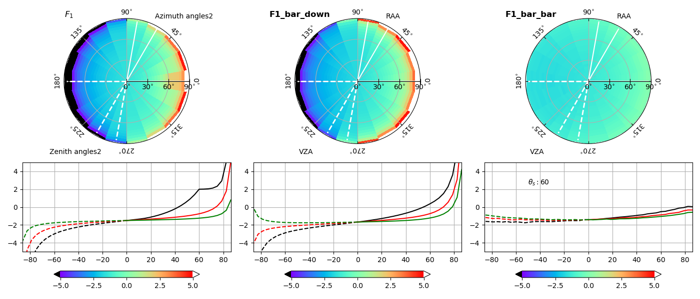{width="5.822834645669292in" height="2.4960629921259843in"} |
+:============================================================================================================================================================================================+
| 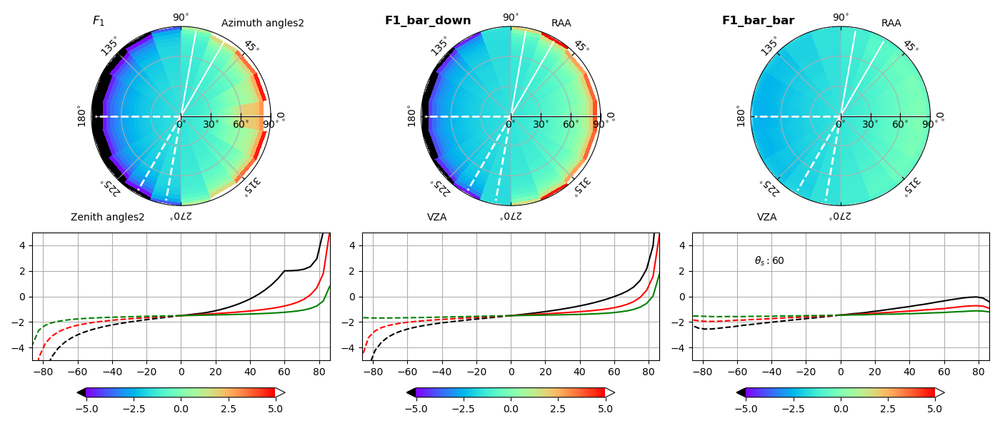{width="5.822834645669292in" height="2.4960629921259843in"} |
+---------------------------------------------------------------------------------------------------------------------------------------------------------------------------------------------+
| 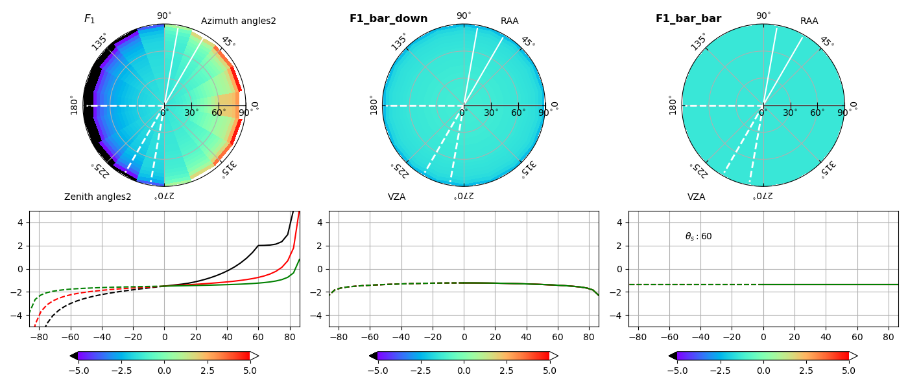{width="5.822834645669292in" height="2.4960629921259843in"} |
+---------------------------------------------------------------------------------------------------------------------------------------------------------------------------------------------+

Figure : Polar plots of F1: geometric kernel (left), single and double directional averages ${\overline{F}}_{1}$ (centre) and $\overline{\overline{F_{1}}}$ (right) as a function of view zenith angle (VZA) and relative azimuth angles (RAA) and for a SZA of 60° and λ=865 nm. Transects correspond to RAA=0 (black), 60 (red) and 90° (green). (TOP) AOT=0.01, (MIDDLE) AOT=0.4, (BOTTOM) the sky downward radiance is assumed isotropic.

+----------------------------------------------------------------------------------------------------------------------------------------------------------------------------------------------+
| 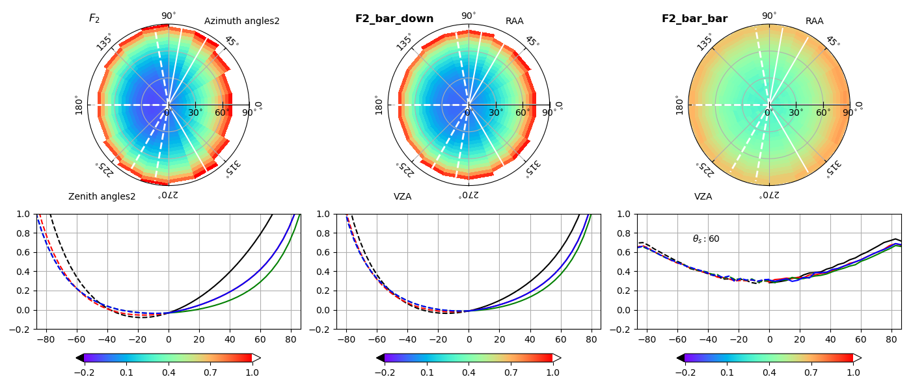{width="5.822834645669292in" height="2.4960629921259843in"} |
+:=============================================================================================================================================================================================+
| 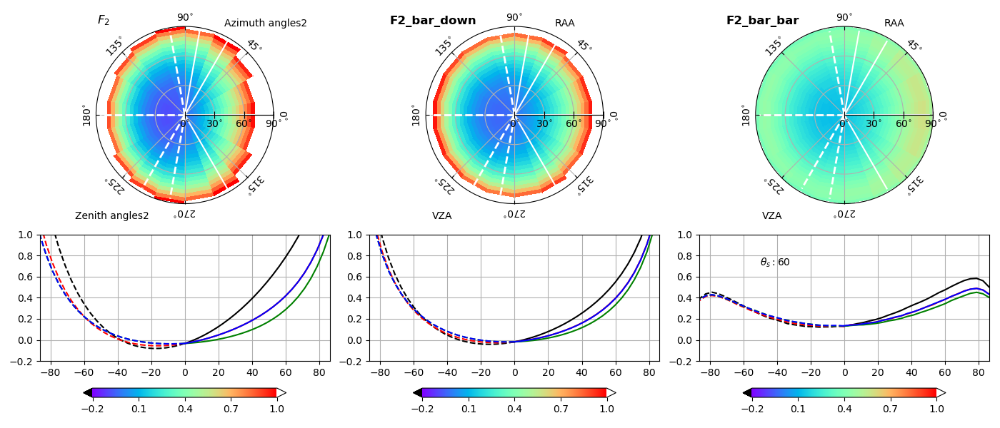{width="5.822834645669292in" height="2.4960629921259843in"}  |
+----------------------------------------------------------------------------------------------------------------------------------------------------------------------------------------------+
| 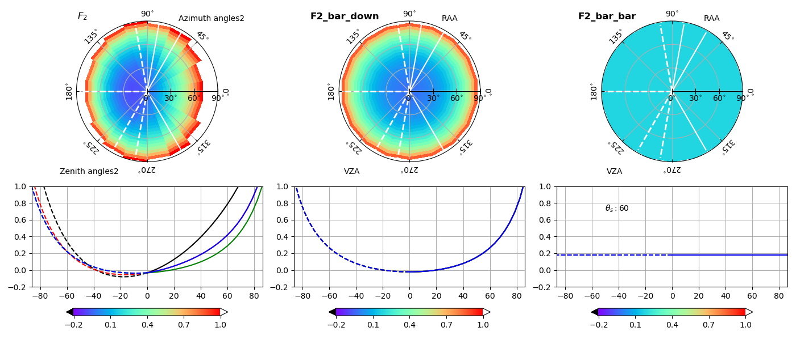{width="5.822834645669292in" height="2.4960629921259843in"}  |
+----------------------------------------------------------------------------------------------------------------------------------------------------------------------------------------------+

Figure : Same as Figure 10 but for the volumetric kernel${\ F}_{2}$.

+--------------------------------------------------------------------------------------------------------------------------------------------------------------------------------------------+
| 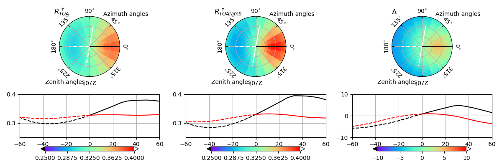{width="6.792361111111111in" height="2.263888888888889in"} |
+:===========================================================================================================================================================================================+
| 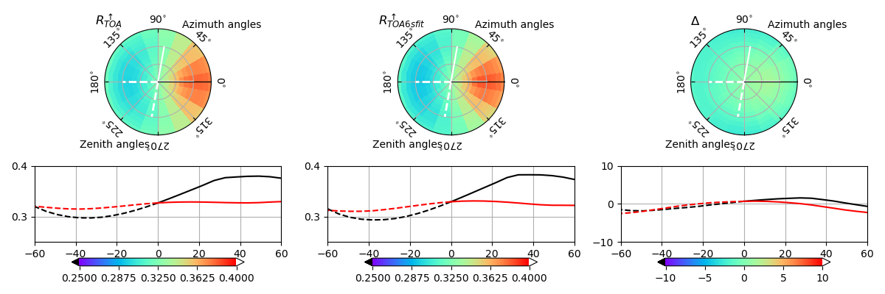{width="6.792361111111111in" height="2.263888888888889in"} |
+--------------------------------------------------------------------------------------------------------------------------------------------------------------------------------------------+

Figure 12 : Polar plots of the TOA reflectance for the Proba-V NIR band and for a typical vegetation target modelled as \[k~0~=0.36, k~1~=0.03, k~2~ =0.24\] and for SZA = 30° and AOT=0.4. The transects correspond to RAA=0° (black), and 90° (red) (Left) Exact computation, (centre) Approximation and (right) relative difference in % between approximation and exact computations. (TOP) 6S formulation where the surface is considered lambertian, (BOTTOM) 6S formulation with a modelled surface BRDF as described in this section.

| 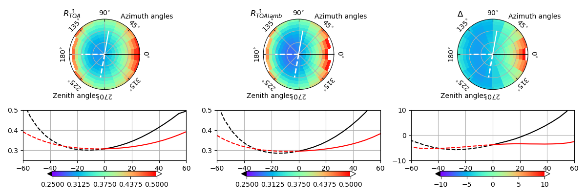{width="6.792361111111111in" height="2.263888888888889in"} |
|:---|
| 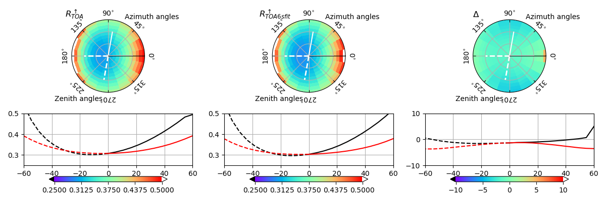{width="6.792361111111111in" height="2.263888888888889in"} |

Figure : same as Figure 12 but for SZA=60°.

# Appendix B: Aerosol Model Definitions

## Aerosol variability on Earth

44 688 MERRA-2 grid points have been selected over land. Four dates have been chosen to represent the seasonal variability: 2011/01/01, 2011/04/01, 2011/07/01, and 2011/10/01. Data is taken at 13:00.

Global average of AOT is computed for each component for the four dates. The total AOT increases from winter to summer, especially because of desert dust and OC. Indeed, desert dust AOT increases from 0.04 to 0.10 and OC AOT from 0.02 to 0.05. The three other components AOT vary little with the season.

The aerosol models are defined according to the MERRA-2 5 AOT ratios of each aerosol component u {X~u~, u$\  \in \{ DU,SU,OC,BC,SS\ \}$}:

X~u~ = $\frac{\mathbf{\tau}_{\mathbf{a}\mathbf{;}\mathbf{u}}^{\mathbf{550}}}{\mathbf{\tau}_{\mathbf{a}}^{\mathbf{550}}}$

::: {.content-visible when-format="docx"}
{width="6.075in" height="7.541666666666667in"}
:::

::: {.content-visible when-format="pdf"}
*(Figure omitted in PDF export: original table is a Windows EMF vector graphic not convertible in this environment; see the DOCX version of this ATBD for the figure.)*
:::

Table : Statistics about AOT's of each aerosol component from MERRA-2 analysis of 4 days in 2011

Each mixing ratio X~u~ covers the 0-100% range except BC which remains smaller than 25% on the four dates. The SU, DU, OC and SS X~u~ are defined between 0 and 100% with steps of 20%, and the BC X~u~ is defined between 0 and 30% with a step of 5%.

From the 5x5x5x5x6=3750 possible combinations, 148 combinations of the component X~u~ effectively occur on the 44 688 pixels of 2011/07/01. These 148 combinations of the components X~u~ define 148 aerosol models. (See Figure 14)

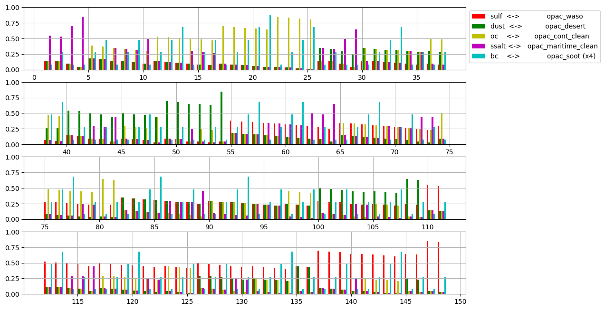{width="6.146489501312336in" height="3.7656889763779526in"}

Figure : AOT's ratio's X~u~ of the 5 MERRA-2 aerosol components of the 148 aerosol model used in this study

## Aerosol optical properties

To calculate easily the optical properties of these mixing, we directly associate one OPAC aerosol model/component with each component u from MERRA-2 (see Table 13). For the moment the relative humidity is considered fixed to 80%

Table : Mapping between MERRA-2 aerosol component and OPAC for the computation of optical properties

| **MERRA-2 aerosol component** | **OPAC model or component (RH=80%)** |
|:------------------------------|:-------------------------------------|
| SU/SU                         | Antarctic model                      |
| DU/DU                         | Desert model                         |
| OC/OM                         | Water soluble (waso) component       |
| SS/SS                         | Maritime clean model                 |
| BC/BC                         | Soot component                       |

The aerosol optical properties necessary for SMAC are then computed like this:

Spectral dependence of the AOT K (λ)=$\frac{\tau(\lambda)}{\tau}(550)$:

$K(\lambda) = \sum_{u}^{}{K_{u}(\lambda)X}_{u}$

Single scattering albedo:

$\varpi_{0}(\lambda) = \sum_{u}^{}{\varpi_{0}^{u}{(\lambda)X}_{u}}$

Phase function:

$P(\theta,\lambda) = \sum_{u}^{}{P_{u}(\theta,\lambda)X_{u}}$

And the derived asymmetry parameter:

$g(\lambda) = \frac{1}{2}\int_{- 1}^{1}{\mu P(\mu,\lambda)}d\mu$ with $\mu = cos(\theta)$

These aerosol optical properties are plotted in Figure 15 and Figure 16.

| 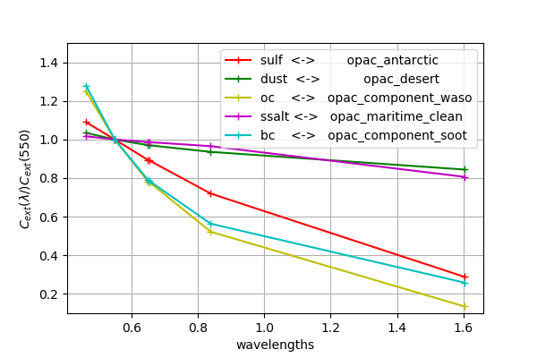{width="3.5984251968503935in" height="2.3976377952755907in"} |
|:---|
| 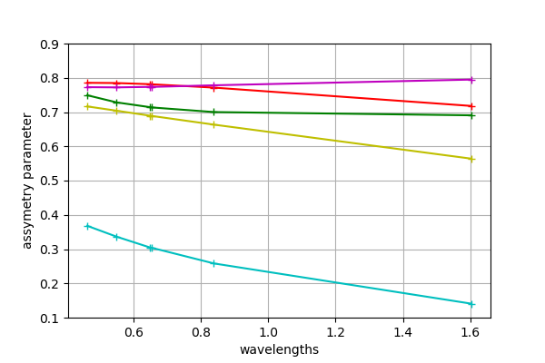{width="3.5984251968503935in" height="2.3976377952755907in"} |
| 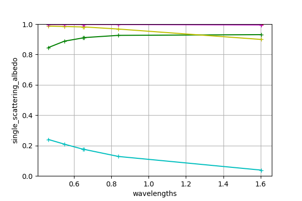{width="3.5984251968503935in" height="2.3976377952755907in"} |

Figure : OPAC Aerosols components optical properties with RH=80% at the Proba-V spectral bands

| 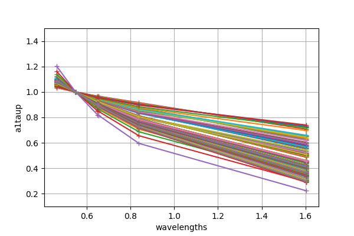{width="3.5984251968503935in" height="2.3976377952755907in"} |
|:---|
| 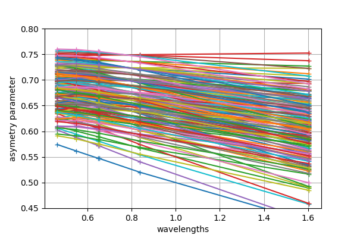{width="3.5984251968503935in" height="2.3976377952755907in"} |
| 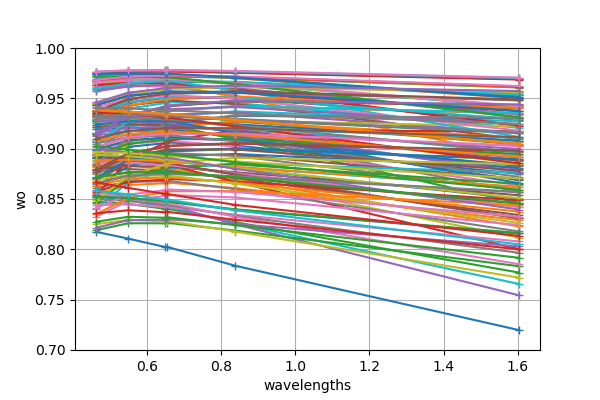{width="3.5984251968503935in" height="2.3976377952755907in"} |

Figure : 148 Aerosols mixtures optical properties at the Proba-V spectral bands.

# Appendix C: SMAC-CL Implementation

## Input reading

The elevation map and its uncertainty (elev and Delev) are read from the DEM auxiliary file [once]{.underline} ( see section 2.2).

The image inputs are read from Level 1 files (Section 2.1). For each pixel of the image, the following quantities are read:

- The TOA radiance for each sensor channel *λ*: TOA-r(*λ*)

- The corresponding error: DTOA-r(*λ*),

- The corresponding solar extra-terrestrial irradiance Es(*λ*)

- The sun zenith angle (SZA), the sun azimuth angle (SAA), the view zenith angles (VZA, VZA_SWIR), and the viewing azimuth angle (VAA, VAA_SWIR),

- The latitude and longitude: lat, lon*,*

The [name of the sensor, date and mean time of acquisition (in UTC)]{.underline} should be written in the file as an [attribute]{.underline}. Indeed, the name of the sensor and the date of acquisition allow reading the right SMAC coefficients coeffs while the date allows reading the daily MERRA-2 auxiliary files as described in Section 2.3 and monthly AMIP auxiliary files as described in Section 2.4.

If the BRDF effects estimation is activated in the configuration, then we build the right name for auxiliary C3S Surface Albedo product as in section 2.6 .

## Pixel masking

The cloud contaminated are masked and not further processed. The selection is based on the cloud flag already present in the input file. The idea is to keep [the clearest pixels only]{.underline}. It is done by selecting pixels for which the flag is 0. We mask out also pixels for which SZA is above 90°.

## Spatial and temporal interpolation of auxiliary data

From elev, Delev, lat, lon, the pixel altitude **z** and its uncertainty **∆z** is obtained through a [nearest neighbor interpolation]{.underline}.

The sea-level pressure **P~0~**, the temperature above ground **T**, the total ozone column$\ \mathbf{U}_{\mathbf{O}_{\mathbf{3}}}$, the total column water vapor$\ \mathbf{U}_{\mathbf{H}_{\mathbf{2}}\mathbf{O}}$ and the AOT at 550 nm $\mathbf{\tau}_{\mathbf{a}}^{\mathbf{550}}$ , $\mathbf{\tau}_{\mathbf{a;DU}}^{\mathbf{550}}\mathbf{,\ }\mathbf{\tau}_{\mathbf{a;SU}}^{\mathbf{550}}\mathbf{,}\mathbf{\tau}_{\mathbf{a;OC}}^{\mathbf{550}}\mathbf{,}\mathbf{\tau}_{\mathbf{a;BC}}^{\mathbf{550}}\mathbf{,}\mathbf{\tau}_{\mathbf{a;SS}}^{\mathbf{550}}$are obtained respectively from the SLP, T10M, TO3, TQV and TOTEXTTAU, DUEXTTAU, SUEXTTAU, OCEXTTAU, BCEXTTAU, SSEXTTAU MERRA-2 auxiliary data (see section2.3) through a [spatial and temporal linear interpolation]{.underline}

Then the monthly means of aerosol optical thicknesses coming from the AMIP 10 runs are loaded and [spatially interpolated]{.underline} to give $\mathbf{\tau}_{\mathbf{a;AMIPj}}^{\mathbf{550}}$ ,

$\mathbf{\tau}_{\mathbf{a;DU;AMIPj}}^{\mathbf{550}}\mathbf{,\ }\mathbf{\tau}_{\mathbf{a;SU;AMIPj}}^{\mathbf{550}}\mathbf{,}\mathbf{\tau}_{\mathbf{a;OC;AMIPj}}^{\mathbf{550}}\mathbf{,}\mathbf{\tau}_{\mathbf{a;BC;AMIPj}}^{\mathbf{550}}\mathbf{,}\mathbf{\tau}_{\mathbf{a;SS;AMIPj}}^{\mathbf{550}}$ for **model run number j**. The fields TOTEXTTAU, DUEXTTAU, SUEXTTAU, OCEXTTAU, BCEXTTAU, SSEXTTAU from the AMIP auxiliary files are used (see section 2.4**Erreur ! Source du renvoi introuvable.**)

The auxiliary data is then converted from MERRA-2 to SMAC units:

1.  Table: MERRA-2 and SMAC units

| Variable | MERRA-2 unit | SMAC unit | Conversion factor |
|:---------|:-------------|:----------|:------------------|
| U~O3~    | Dobson       | cm.atm    | 1e-3              |
| U~H2O~   | kg.m^-2^     | g.cm^-2^  | 1e-1              |
| P~0~     | Pa           | hPa       | 1e-2              |

Then, the surface pressure **P~s~** and its uncertainty **∆P~s~** are computed using Eq. (20), (21), and (22), (23), (24).

Interpolate spatially to have BRDF parameters k~1p~ and k~2p~

## Aerosols models selections

Select the aerosol model number (between 148 models), by minimizing the distance in a 5-dimensional space corresponding to the 5 AOT ratios {X~u~, u$\  \in \{ DU,SU,OC,BC,SS\ \}$} of the 5 aerosol components

X~u~ = $\frac{\mathbf{\tau}_{\mathbf{a}\mathbf{;}\mathbf{u}}^{\mathbf{550}}}{\mathbf{\tau}_{\mathbf{a}}^{\mathbf{550}}}$

**iaero** = $\text{argmin}_i \sum_{u} \left(X_u - X_{u,i}\right)^{2}$, for $i=0,\ldots,147$.

The X~u,i~ basis for the 148 predefined models are stored in a text file and read once.

An example of interpolated inputs is given in Figure 17 : Example of inputs ancillary atmospheric data for a VGT sub-image

The list of aerosol models of AMIP are also computed using the same approach to give **iaero~AMIPj~** for j in 1...10

## SMAC-CL function

**Architecture:**

- Language: OpenCL (compatible with GPU and CPU)
- Interface: Python wrapper
- Processing mode: Pixel-parallel (massively parallel on GPU)

**Main Processing Function:**

```         
def smac_cl_run(
    coeffs,           # SMAC coefficients (148 aerosol models)
    tetas, tetav,     # SZA, VZA arrays
    phis, phiv,       # SAA, VAA arrays
    uh2o, uo3,        # Water vapor, ozone columns
    taup550,          # AOD at 550 nm
    pressure,         # Surface pressure
    rtoa,             # TOA reflectance
    k1p, k2p,         # BRDF kernel ratios (default 0 for Lambertian)
    iaero_list        # List of aerosol model indices (11 models)
):
    """
    Inputs: All arrays dimensioned [npixels] or [nbands, npixels]
    Outputs:
      - rtoc: TOC reflectance [nbands, npixels]
      - jacobians: Sensitivity matrices
      - u_ensemble: Std dev from aerosol ensemble
    """
```

**Processing Flow:**

```         
┌─────────────────────────────────────────────────────┐
│  1. Reorganize input arrays for GPU efficiency      │
│     (transpose, flatten, pad)                       │
└──────────────────┬──────────────────────────────────┘
                   │
                   ▼
┌─────────────────────────────────────────────────────┐
│  2. Upload data to GPU/CPU memory                   │
│     - TOA reflectances                              │
│     - Geometry arrays                               │
│     - Auxiliary data (UH₂O, UO₃, Ps, τa)            │
│     - SMAC coefficients (pre-loaded once)           │
└──────────────────┬──────────────────────────────────┘
                   │
                   ▼
┌─────────────────────────────────────────────────────┐
│  3. GPU/CPU kernel execution (per-pixel parallel)   │
│     For each pixel in parallel:                     │
│       a. Compute gaseous transmissions              │
│       b. Compute Rayleigh scattering                │
│       c. Compute aerosol scattering                 │
│       d. Apply SMAC equations → Rtoc                │
│       e. Compute analytical Jacobians               │
│       f. Repeat for finite-difference Jacobians     │
│       g. Repeat for 10 aerosol ensemble members     │
└──────────────────┬──────────────────────────────────┘
                   │
                   ▼
┌─────────────────────────────────────────────────────┐
│  4. Download results from GPU/CPU                   │
│     - Rtoc arrays                                   │
│     - Jacobian arrays                               │
│     - Ensemble statistics                           │
└──────────────────┬──────────────────────────────────┘
                   │
                   ▼
┌─────────────────────────────────────────────────────┐
│  5. CPU post-processing                             │
│     - Combine uncertainty components                │
│     - Apply terrain corrections                     │
│     - Quality flag assignment                       │
└─────────────────────────────────────────────────────┘
```

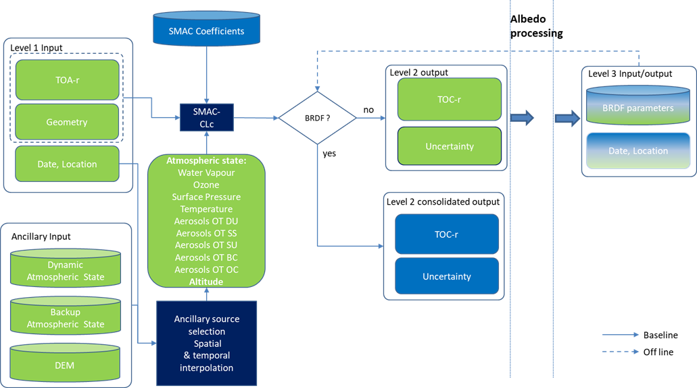{width="6.873611111111111in" height="3.8402777777777777in"}

**Performance:**

- GPU acceleration: \~100× faster than CPU for large images
- Memory requirement: \~2 GB GPU RAM for full-swath processing
- Typical processing time: \<TBD second per tile (1000×1000 pixels)

The SMAC-CL run procedure inputs correspond to the following quantities described in this document:

coeffs, SZA, VZA, SAA, VAA,$\mathbf{U}_{\mathbf{H}_{\mathbf{2}}\mathbf{O}}$,$\mathbf{U}_{\mathbf{O}_{\mathbf{3}}}$,$\mathbf{\tau}_{\mathbf{a}}^{\mathbf{550}}$, **P~s~**, TOA-r(*λ*), k1p, k2p, iaero_list.

The run method is called twice, one for the VIS-NIR bands and one for the SWIR band. iaero_list contains 11 aerosol model number. The first one is iaero, the 10 others are iaero_AMIPj ( see section 10.4).

Upon selection in the configuration, the k1p and k2p arrays are set to zero, that means that the surface is considered lambertian. A call with these coefficients not set to zero, for example using L3 BRDF products allows to estimate the effect of BRDF on the TOC-r

All the image inputs are multidimensional

The outputs of the SMAC-CL run routine are:

- The AC corrected directional reflectance $\mathbf{R}_{\mathbf{toc}}$ for each sensor channel *λ*

- The Jacobians$\ \mathbf{J}_{\mathbf{R}_{\mathbf{toc}}}^{\mathbf{R}_{\mathbf{toa}}}\mathbf{,\ }\mathbf{J}_{\mathbf{R}_{\mathbf{toc}}}^{\mathbf{U}_{\mathbf{O}_{\mathbf{3}}}}\mathbf{,\ }\mathbf{J}_{\mathbf{R}_{\mathbf{toc}}}^{\mathbf{U}_{\mathbf{H}_{\mathbf{2}}\mathbf{O}}}\mathbf{,\ }\mathbf{J}_{\mathbf{R}_{\mathbf{toc}}}^{\mathbf{U}_{\mathbf{P}_{\mathbf{S}}}}\mathbf{\ ,\ }\mathbf{J}_{\mathbf{R}_{\mathbf{toc}}}^{\mathbf{\tau}_{\mathbf{a}}^{\mathbf{550}}}$ for each sensor channel *λ*

- The standard deviation ${\mathbf{u}\left( \mathbf{R}_{\mathbf{toc}} \right)}_{\mathbf{ensemble}}$ due to aerosol models spread for each sensor channel *λ*

An example of the outputs and Jacobians is given in Figure 18

## Level 2A Output Variables

The standard outputs of AC module are:

- The AC corrected directional reflectance $\mathbf{R}_{\mathbf{toc}}$ for each sensor channel *λ*,

- The associated uncertainties $\mathbf{\mathrm{\Delta}}\mathbf{R}_{\mathbf{toc}}$for each sensor channel *λ*,

- Flags

  - Bit 0 : cloud \_contaminated (clm != 0)

  - Bit 1 : High AOD (TOA \>= 0.6)

  - Bit 2 : High SZA (sza \> 80.)

  - Bit 3 : High AOD gradient (aod_grad \> Threshold)

  - Bit 4 : AC algorithm failure

  - Bit 5 : Missing auxiliary data

  - Bit 6 : Out of LUT range

TOC directional reflectances and Jacobians are direct outputs of the SMAC procedure (done in the GPU) while the [associated uncertainties are post-processed in the CPU]{.underline} as described in section 5.2. The quantities used are:

- The Jacobians $\mathbf{J}_{\mathbf{R}_{\mathbf{toc}}}^{\mathbf{R}_{\mathbf{toa}}}\mathbf{,\ }\mathbf{J}_{\mathbf{R}_{\mathbf{toc}}}^{\mathbf{U}_{\mathbf{O}_{\mathbf{3}}}}\mathbf{,\ }\mathbf{J}_{\mathbf{R}_{\mathbf{toc}}}^{\mathbf{U}_{\mathbf{H}_{\mathbf{2}}\mathbf{O}}}\mathbf{,\ }\mathbf{J}_{\mathbf{R}_{\mathbf{toc}}}^{\mathbf{U}_{\mathbf{P}_{\mathbf{S}}}}\mathbf{\ ,\ }\mathbf{J}_{\mathbf{R}_{\mathbf{toc}}}^{\mathbf{\tau}_{\mathbf{a}}^{\mathbf{550}}}$

- DTOA-r(*λ*), $\mathrm{\Delta}\mathbf{U}_{\mathbf{O}_{\mathbf{3}}}$, $\mathrm{\Delta}\mathbf{U}_{\mathbf{H}_{\mathbf{2}}\mathbf{O}}$, $\mathrm{\Delta}\mathbf{P}_{\mathbf{S}}$, $\mathrm{\Delta}\mathbf{\tau}_{\mathbf{a}}^{\mathbf{550}}$)

- ${\mathbf{u}\left( \mathbf{R}_{\mathbf{toc}} \right)}_{\mathbf{ensemble}}$**, slope_error,** ${\mathbf{u}\left( \mathbf{R}_{\mathbf{toc}} \right)}_{\mathbf{RTM}}$

The projection and the attributes of the input TOA reflectances are kept. Nevertheless, the longitude and latitude fields are also written in the output file for simplicity.

An example of the outputs is given in.

**File:** PROBAV_L1C_20141111_184634_2_1KM_V301_toc.nc

**Number of variables:** 83

## Output file structure

| **Variable** | **Dimensions** | **Shape** | **Dtype** | **Units** | **Long Name** |
|:---|:---|:---|:---|:---|:---|
| AOD_550_used | ('height', 'width') | (4275, 2601) | float32 | 1 | Aerosol Optical Depth at 550nm |
| Jacobian_Rtoc_vs_AOD_B1 | ('height', 'width') | (4275, 2601) | float32 | N/A | N/A |
| Jacobian_Rtoc_vs_AOD_B2 | ('height', 'width') | (4275, 2601) | float32 | N/A | N/A |
| Jacobian_Rtoc_vs_AOD_B3 | ('height', 'width') | (4275, 2601) | float32 | N/A | N/A |
| Jacobian_Rtoc_vs_AOD_B4 | ('height', 'width') | (4275, 2601) | float32 | N/A | N/A |
| Jacobian_Rtoc_vs_Ps_B1 | ('height', 'width') | (4275, 2601) | float32 | hPa-1 | Jacobian of TOC reflectance with respect to pressure |
| Jacobian_Rtoc_vs_Ps_B2 | ('height', 'width') | (4275, 2601) | float32 | hPa-1 | Jacobian of TOC reflectance with respect to pressure |
| Jacobian_Rtoc_vs_Ps_B3 | ('height', 'width') | (4275, 2601) | float32 | hPa-1 | Jacobian of TOC reflectance with respect to pressure |
| Jacobian_Rtoc_vs_Ps_B4 | ('height', 'width') | (4275, 2601) | float32 | hPa-1 | Jacobian of TOC reflectance with respect to pressure |
| Jacobian_Rtoc_vs_Rtoa_B1 | ('height', 'width') | (4275, 2601) | float32 | 1 | Jacobian of TOC reflectance with respect to TOA reflectance |
| Jacobian_Rtoc_vs_Rtoa_B2 | ('height', 'width') | (4275, 2601) | float32 | 1 | Jacobian of TOC reflectance with respect to TOA reflectance |
| Jacobian_Rtoc_vs_Rtoa_B3 | ('height', 'width') | (4275, 2601) | float32 | 1 | Jacobian of TOC reflectance with respect to TOA reflectance |
| Jacobian_Rtoc_vs_Rtoa_B4 | ('height', 'width') | (4275, 2601) | float32 | 1 | Jacobian of TOC reflectance with respect to TOA reflectance |
| Jacobian_Rtoc_vs_UH2O_B1 | ('height', 'width') | (4275, 2601) | float32 | cm2 g-1 | Jacobian of TOC reflectance with respect to water vapor |
| Jacobian_Rtoc_vs_UH2O_B2 | ('height', 'width') | (4275, 2601) | float32 | cm2 g-1 | Jacobian of TOC reflectance with respect to water vapor |
| Jacobian_Rtoc_vs_UH2O_B3 | ('height', 'width') | (4275, 2601) | float32 | cm2 g-1 | Jacobian of TOC reflectance with respect to water vapor |
| Jacobian_Rtoc_vs_UH2O_B4 | ('height', 'width') | (4275, 2601) | float32 | cm2 g-1 | Jacobian of TOC reflectance with respect to water vapor |
| Jacobian_Rtoc_vs_UO3_B1 | ('height', 'width') | (4275, 2601) | float32 | cm2 g-1 | Jacobian of TOC reflectance with respect to ozone |
| Jacobian_Rtoc_vs_UO3_B2 | ('height', 'width') | (4275, 2601) | float32 | cm2 g-1 | Jacobian of TOC reflectance with respect to ozone |
| Jacobian_Rtoc_vs_UO3_B3 | ('height', 'width') | (4275, 2601) | float32 | cm2 g-1 | Jacobian of TOC reflectance with respect to ozone |
| Jacobian_Rtoc_vs_UO3_B4 | ('height', 'width') | (4275, 2601) | float32 | cm2 g-1 | Jacobian of TOC reflectance with respect to ozone |
| Quality_flag | ('height', 'width') | (4275, 2601) | int16 | N/A | N/A |
| Rtoc_B1 | ('height', 'width') | (4275, 2601) | float32 | 1 | Top of Canopy Bidirectional Reflectance Factor |
| Rtoc_B2 | ('height', 'width') | (4275, 2601) | float32 | 1 | Top of Canopy Bidirectional Reflectance Factor |
| Rtoc_B3 | ('height', 'width') | (4275, 2601) | float32 | 1 | Top of Canopy Bidirectional Reflectance Factor |
| Rtoc_B4 | ('height', 'width') | (4275, 2601) | float32 | 1 | Top of Canopy Bidirectional Reflectance Factor |
| Rtoc_uncertainty_B1 | ('height', 'width') | (4275, 2601) | float32 | 1 | Top of Canopy Reflectance Uncertainty |
| Rtoc_uncertainty_B2 | ('height', 'width') | (4275, 2601) | float32 | 1 | Top of Canopy Reflectance Uncertainty |
| Rtoc_uncertainty_B3 | ('height', 'width') | (4275, 2601) | float32 | 1 | Top of Canopy Reflectance Uncertainty |
| Rtoc_uncertainty_B4 | ('height', 'width') | (4275, 2601) | float32 | 1 | Top of Canopy Reflectance Uncertainty |
| SAA | ('height', 'width') | (4275, 2601) | float32 | degree | Solar Azimuth Angle |
| SM_MAP_B1 | ('height', 'width') | (4275, 2601) | uint8 | 1 | Status Map |
| SM_MAP_B2 | ('height', 'width') | (4275, 2601) | uint8 | 1 | Status Map |
| SM_MAP_B3 | ('height', 'width') | (4275, 2601) | uint8 | 1 | Status Map |
| SM_MAP_B4 | ('height', 'width') | (4275, 2601) | uint8 | 1 | Status Map |
| SZA | ('height', 'width') | (4275, 2601) | float32 | degree | Solar Zenith Angle |
| VAA | ('height', 'width') | (4275, 2601) | float32 | degree | Sensor Azimuth Angle (VNIR) |
| VAA_IR | ('height', 'width') | (4275, 2601) | float32 | degree | Sensor Azimuth Angle (SWIR) |
| VZA | ('height', 'width') | (4275, 2601) | float32 | degree | Sensor Zenith Angle (VNIR) |
| VZA_IR | ('height', 'width') | (4275, 2601) | float32 | degree | Sensor Zenith Angle (SWIR) |
| aerosol_model_index | ('height', 'width') | (4275, 2601) | int32 | N/A | N/A |
| clm | ('height', 'width') | (4275, 2601) | uint8 | 1 | Cloud Mask |
| lat | ('height', 'width') | (4275, 2601) | float32 | degrees_north | Latitude |
| lon | ('height', 'width') | (4275, 2601) | float32 | degrees_east | Longitude |
| ozone_column_used | ('height', 'width') | (4275, 2601) | float32 | DU | Total Column Ozone |
| surface_pressure_used | ('height', 'width') | (4275, 2601) | float32 | Pa | Sea Level Pressure |
| uncertainty_from_RTM_BRDF_B1 | ('height', 'width') | (4275, 2601) | float32 | N/A | N/A |
| uncertainty_from_RTM_BRDF_B2 | ('height', 'width') | (4275, 2601) | float32 | N/A | N/A |
| uncertainty_from_RTM_BRDF_B3 | ('height', 'width') | (4275, 2601) | float32 | N/A | N/A |
| uncertainty_from_RTM_BRDF_B4 | ('height', 'width') | (4275, 2601) | float32 | N/A | N/A |
| uncertainty_from_RTM_fit_B1 | ('height', 'width') | (4275, 2601) | float32 | N/A | N/A |
| uncertainty_from_RTM_fit_B2 | ('height', 'width') | (4275, 2601) | float32 | N/A | N/A |
| uncertainty_from_RTM_fit_B3 | ('height', 'width') | (4275, 2601) | float32 | N/A | N/A |
| uncertainty_from_RTM_fit_B4 | ('height', 'width') | (4275, 2601) | float32 | N/A | N/A |
| uncertainty_from_RTM_terrain_B1 | ('height', 'width') | (4275, 2601) | float32 | N/A | N/A |
| uncertainty_from_RTM_terrain_B2 | ('height', 'width') | (4275, 2601) | float32 | N/A | N/A |
| uncertainty_from_RTM_terrain_B3 | ('height', 'width') | (4275, 2601) | float32 | N/A | N/A |
| uncertainty_from_RTM_terrain_B4 | ('height', 'width') | (4275, 2601) | float32 | N/A | N/A |
| uncertainty_from_TOA_B1 | ('height', 'width') | (4275, 2601) | float32 | N/A | N/A |
| uncertainty_from_TOA_B2 | ('height', 'width') | (4275, 2601) | float32 | N/A | N/A |
| uncertainty_from_TOA_B3 | ('height', 'width') | (4275, 2601) | float32 | N/A | N/A |
| uncertainty_from_TOA_B4 | ('height', 'width') | (4275, 2601) | float32 | N/A | N/A |
| uncertainty_from_aerosol_B1 | ('height', 'width') | (4275, 2601) | float32 | N/A | N/A |
| uncertainty_from_aerosol_B2 | ('height', 'width') | (4275, 2601) | float32 | N/A | N/A |
| uncertainty_from_aerosol_B3 | ('height', 'width') | (4275, 2601) | float32 | N/A | N/A |
| uncertainty_from_aerosol_B4 | ('height', 'width') | (4275, 2601) | float32 | N/A | N/A |
| uncertainty_from_aod_B1 | ('height', 'width') | (4275, 2601) | float32 | N/A | N/A |
| uncertainty_from_aod_B2 | ('height', 'width') | (4275, 2601) | float32 | N/A | N/A |
| uncertainty_from_aod_B3 | ('height', 'width') | (4275, 2601) | float32 | N/A | N/A |
| uncertainty_from_aod_B4 | ('height', 'width') | (4275, 2601) | float32 | N/A | N/A |
| uncertainty_from_h2o_B1 | ('height', 'width') | (4275, 2601) | float32 | N/A | N/A |
| uncertainty_from_h2o_B2 | ('height', 'width') | (4275, 2601) | float32 | N/A | N/A |
| uncertainty_from_h2o_B3 | ('height', 'width') | (4275, 2601) | float32 | N/A | N/A |
| uncertainty_from_h2o_B4 | ('height', 'width') | (4275, 2601) | float32 | N/A | N/A |
| uncertainty_from_ozone_B1 | ('height', 'width') | (4275, 2601) | float32 | N/A | N/A |
| uncertainty_from_ozone_B2 | ('height', 'width') | (4275, 2601) | float32 | N/A | N/A |
| uncertainty_from_ozone_B3 | ('height', 'width') | (4275, 2601) | float32 | N/A | N/A |
| uncertainty_from_ozone_B4 | ('height', 'width') | (4275, 2601) | float32 | N/A | N/A |
| uncertainty_from_pressure_B1 | ('height', 'width') | (4275, 2601) | float32 | N/A | N/A |
| uncertainty_from_pressure_B2 | ('height', 'width') | (4275, 2601) | float32 | N/A | N/A |
| uncertainty_from_pressure_B3 | ('height', 'width') | (4275, 2601) | float32 | N/A | N/A |
| uncertainty_from_pressure_B4 | ('height', 'width') | (4275, 2601) | float32 | N/A | N/A |
| water_vapor_column_used | ('height', 'width') | (4275, 2601) | float32 | kg m-2 | Total Precipitable Water Vapor |

Standard outputs variables (TOC-reflectances and total associated uncertainties). Optional outputs variables (Jacobians and uncertainty contributors). Debug output variables (MERRA-2 inputs and aerosol model index)

**Quality Flags:**

- Bit 0: Cloud-contaminated pixel
- Bit 1: High AOD (\>0.8)
- Bit 2: High SZA (\>70°)
- Bit 3: High AOD gradient (AOD quality risks)
- Bit 4: AC algorithm failure
- Bit 5: Missing auxiliary data
- Bit 6: Out-of-LUT range

**Global Attributes:**

- Processing algorithm version
- SMAC coefficients version
- MERRA-2 data version and date
- AMIP ensemble run IDs
- DEM version
- Processing date/time
- Geographic coverage

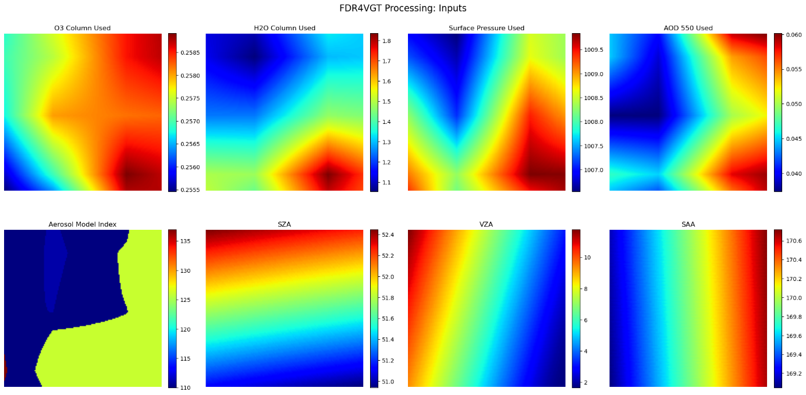{width="6.3in" height="3.0898490813648296in"}

Figure : Example of inputs ancillary atmospheric data for a VGT sub-image

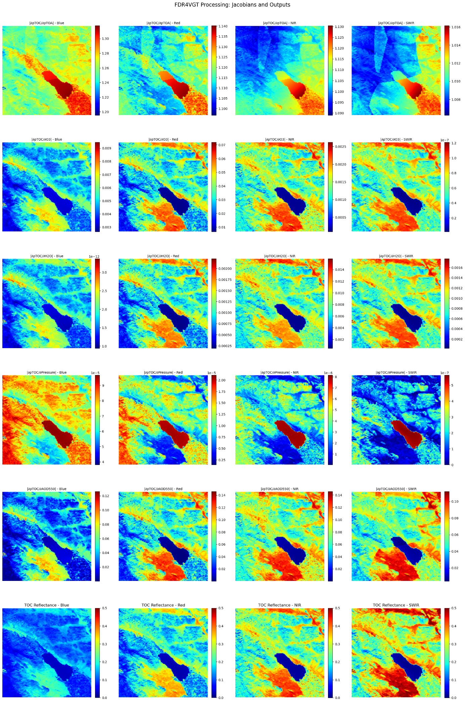{width="6.297829177602799in" height="9.484722222222222in"}

Figure : Example of outputs (Jacobians and TOC reflectances)

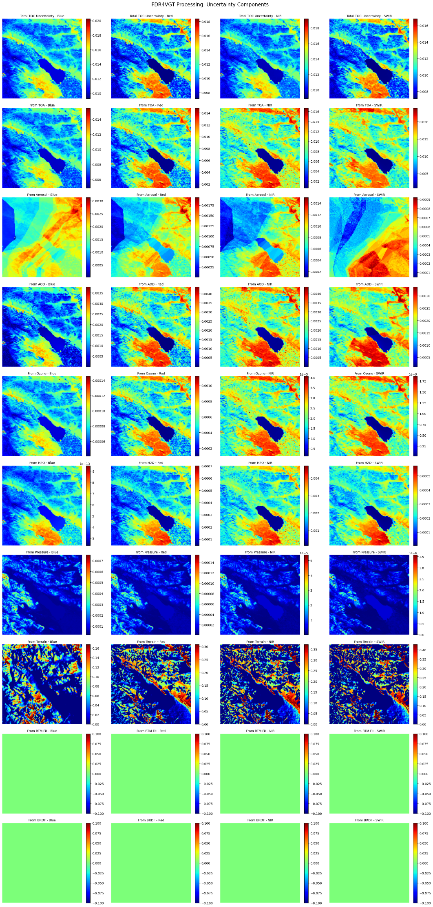{width="4.8125in" height="10.08380905511811in"}

Figure Outputs uncertainties

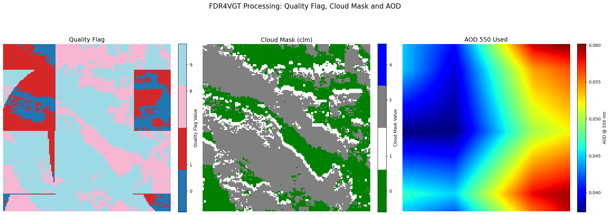{width="6.3in" height="2.2256944444444446in"}

Figure Outputs flags and AOD\@550 used

# Appendix D: Implementation Notes (NEW in v1.1)

This appendix documents implementation-specific details, performance optimizations, and known limitations of the FDR4VGT production codebase (`fdr4vgt_opencl` repository). These are not changes to the scientific algorithm described in Sections 1-10, but engineering decisions for operational efficiency, plus the status of two items flagged in Section 5.5 (Known Limitations).

## D.1 Performance Optimizations

### Ancillary Zarr Cache

| Aspect | Description |
|----|----|
| What | Pre-interpolates MERRA-2 fields to the full satellite grid once, stores them in a local Zarr cache |
| Why | MERRA-2 source files sit on network storage; per-tile interpolation would re-read the network and repeat work |
| Function | `precompute_ancillary()` in `process.py` |
| Toggle | `[Sizes] anc_cache` (default on) |
| Numerical equivalence | Pointwise interpolation → identical to per-tile interpolation (tiles read from local cache with halo) |
| Memory | Streamed tile-by-tile to bound peak memory (\~2.8 GB, safe on 4 GB nodes) |

: Ancillary Zarr cache optimization

Cache format: Zarr format 2. Most fields are stored as float16 (small values, sufficient precision); `SLP` and `T10M` are stored as float32 (see D.2, overflow protection).

### Tile-Based Processing

| Aspect | Description |
|----|----|
| What | Processes the image in overlapping tiles (`batch_size` × `batch_size` with a halo) |
| Why | Bounded memory per tile, parallel processing across workers |
| Function | `process_batched()` generates the tile grid; `_worker_compute_tile()` processes each tile |
| Config | `[Sizes] chunks_size` (default 512), `[Sizes] nworkers` (default 1) |
| Halo | ±1 pixel halo for terrain slope/aspect computation (edge effects) |

: Tile-based processing optimization

### Local Output File

| Aspect | Description |
|----|----|
| What | Writes the output NetCDF to a local temporary file, then moves it to the final destination once at the end |
| Why | Serial per-tile append writes degrade badly on network storage (Ceph): \~2 s → \~5 s per tile |
| Function | `process_batched()` creates a temp file, `shutil.move()` at the end |
| Toggle | `[Sizes] local_output` (default on) |

: Local output file optimization

### Single NetCDF Handle

+----------------------------------+---------------------------------------------------------------------------+
| Aspect                           | Description                                                               |
+==================================+===========================================================================+
| What                             | Opens the output NetCDF handle once and reuses it for all tiles           |
+----------------------------------+---------------------------------------------------------------------------+
| Why                              | Per-tile open/close/flush was the dominant writer cost (HDF5 overhead)    |
+----------------------------------+---------------------------------------------------------------------------+
| Function                         | `nc_out = Dataset(output_path, 'a')` reused across tiles                  |
+----------------------------------+---------------------------------------------------------------------------+
| Flush                            | Periodic close+reopen every `flush_interval` tiles to free the HDF5 cache |
+----------------------------------+---------------------------------------------------------------------------+

: Single NetCDF handle optimization

### DEM Cropping

| Aspect | Description |
|----|----|
| What | Crops the global GTOPO30 DEM to the product's lat/lon extent before loading |
| Why | Full DEM is \~1.9 GB; cropped is \~0.2 GB for a typical narrow longitude range |
| Function | `xrcrop(dem_ds, lat=data['y'], lon=data['x'])` |

: DEM cropping optimization

### Copy-on-Write Shared State

| Aspect | Description |
|----|----|
| What | Pre-forks the worker pool, then populates a `_SHARED` dict (inherited via copy-on-write) |
| Why | Avoids re-pickling large objects (SMAC coefficients, DEM, MERRA-2 cache) for every task |
| Function | `_SHARED.update()` executed before the pool is created |
| Objects | SMAC coefficients (\~100 MB), aerosol model LUT, terrain data |

: Copy-on-write shared state optimization

## D.2 Data Type Requirements

### Float32 for SLP/T10M (Overflow Fix)

+----------------------------------+-----------------------------------------------------------------------------------------------+
| Aspect                           | Description                                                                                   |
+==================================+===============================================================================================+
| Issue                            | The ancillary Zarr cache stored `T10M` and `SLP` as float16                                   |
+----------------------------------+-----------------------------------------------------------------------------------------------+
| Root cause                       | `smaccl.c3s_lib.Ps()` computes `log(R·T)` where $R\cdot T = 287.058 \times 290 \approx 83246$ |
+----------------------------------+-----------------------------------------------------------------------------------------------+
| Overflow                         | 83246 exceeds the float16 max (65504) → NaN in the pressure correction → NaN `Rtoc`           |
+----------------------------------+-----------------------------------------------------------------------------------------------+
| Fix                              | `_MERRA_CACHE_FLOAT32_VARS = {'SLP', 'T10M'}` keeps these two fields as float32               |
+----------------------------------+-----------------------------------------------------------------------------------------------+
| Commit                           | `51f7e68` — "Fix ancillary cache dtype overflow causing NaN rTOC"                             |
+----------------------------------+-----------------------------------------------------------------------------------------------+

: Float32 overflow fix for SLP/T10M

Validation: a full processing run (100 tiles, 241.9 s) shows `Rtoc` finite on land for \~77.2% of pixels and \~0% over ocean (expected, since ocean pixels are masked by cloud/quality flags).

### Float16 for Small-Value Fields

Fields with small values (approximately 0-0.1) are safely stored as float16:

- `ERROR` (uncertainty components)
- `TOTEXTTAU` (AOD values, typically \< 1.0)
- Aerosol species fractions (0-1 range)

These are widened to float32 on NetCDF write (netCDF4 has no native half-float type).

## D.3 Known Limitations — Status in v1.1

### Adjacency Effects

Status: **Not corrected.** Confirmed known limitation.

Impact: significant for high-contrast scenes (coast, cloud edge, urban/rural boundaries). The SMAC algorithm assumes a horizontally homogeneous scene within the pixel footprint; adjacent pixels with different reflectances contribute to the measured TOA radiance through atmospheric scattering, which is not accounted for.

Future work: implement a semi-empirical adjacency correction (e.g. based on scene contrast and atmospheric conditions).

### Köppen-Geiger Regionalization

Status: **Planned feature.**

The AOD uncertainty model (Section 5.3.5, Eq. before Table 6) currently uses a single global relation. Regional multipliers based on Köppen-Geiger climate classification are defined but not yet applied in `compute_urtoc()`:

| Region Type          | Multiplier | Example Locations          |
|----------------------|------------|----------------------------|
| Oceanic/Polar        | 0.7×       | Open oceans, Arctic        |
| North America/Europe | 1.0×       | Baseline reference         |
| Dust-dominated       | 1.5×       | Sahara, Arabian Peninsula  |
| Biomass burning      | 1.4×       | Amazon, Sub-Saharan Africa |
| High pollution       | 1.3×       | East Asia, South Asia      |

: Köppen-Geiger regional AOD uncertainty multipliers (planned)

Data available: `kg_zoneNumGueymard.csv` in the ANCILLARY directory.

### Water Vapor Uncertainty

Status: conservative 20% estimate (unchanged from v1.0).

Impact: may overestimate total uncertainty in dry conditions.

Future work: refined characterization from MERRA-2 validation studies.

## D.4 Tile Processing Architecture

The processing pipeline uses a tile-based architecture for memory-bounded, parallel execution:

```         
process_batched() -- Main entry point
 1. Generate tile grid from input extent
    - Tile size: chunks_size x chunks_size
    - Overlap: +/-1 pixel halo
    - Total tiles: ceil(y/chunks) x ceil(x/chunks)
 2. Precompute ancillary cache (if enabled)
    - Interpolate MERRA-2 to full grid
    - Save to local Zarr cache
 3. Create worker pool (nworkers)
    - Fork workers before populating _SHARED
    - Copy-on-write inheritance of large objects
 4. Process tiles in parallel
    - _worker_compute_tile() per tile
    - SMAC-CL run (VNIR + SWIR)
    - Uncertainty propagation
    - Write tile to NetCDF
 5. Move local output to final destination
```

`_worker_compute_tile()` performs the end-to-end tile computation:

1.  Read tile data from the input L1C file and the ancillary cache
2.  Interpolate the DEM and compute terrain (slope/aspect)
3.  Select the aerosol model (closest in 5D species space)
4.  Run SMAC-CL (VNIR bands, then SWIR band)
5.  Compute the BRDF effect (Lambertian vs BRDF run, if enabled)
6.  Compute the terrain effect (CESBIO model)
7.  Compute the RTM fit uncertainty (ONNX model)
8.  Propagate uncertainties (`compute_urtoc()`)
9.  Build quality flags (`build_flag()`)
10. Write the tile to the output NetCDF

## D.5 Output Format Details

The output NetCDF file follows CF-1.8 conventions, with attributes applied from `cf_attributes_res2.json`.

**Dimensions:**

| Dimension | Size     | Description                              |
|-----------|----------|------------------------------------------|
| `bands`   | 4        | B1 (Blue), B2 (Red), B3 (NIR), B4 (SWIR) |
| `height`  | Variable | Tile height (y dimension)                |
| `width`   | Variable | Tile width (x dimension)                 |

: Output NetCDF dimensions

**Global attributes:**

| Attribute     | Description                          |
|---------------|--------------------------------------|
| `sensor`      | Sensor name (Proba-V, SPOT-VGT)      |
| `date`        | Acquisition date                     |
| `time`        | Mean acquisition time (UTC)          |
| `projection`  | Projection attributes from input L1C |
| `conventions` | CF-1.8                               |
| `history`     | Processing timestamp and version     |

: Output NetCDF global attributes

Each variable also carries `standard_name`, `units`, `long_name`, and `comments` attributes from the CF JSON configuration. The output NetCDF is written with chunk sizes matching the tile processing grid, ensuring efficient random access for downstream consumers.

# Appendix E: SMACCL OpenCL Kernel API (NEW in v1.1)

This appendix documents the SMACCL OpenCL function API as implemented in the HYGEOS `smaccl` repository (OpenCL branch), covering both the Python host wrapper API (`smaccl/smaccl.py`, class `Smaccl`) and the OpenCL kernel API (`smaccl/devicecl.cl`, kernel `smaccl`). It complements the description of the SMAC-CL function given in Appendix C.5, providing a precise implementation-facing contract for integration and maintenance.

## E.1 Python Host API

**Signature:**

```         
def run(
    self,
    coeffs,
    tetas, tetav,
    phis, phiv,
    uh2o, uo3,
    taup550, pression,
    rtoa,
    k1p, k2p,
    iaero,
    NBLOOP=1,
)
```

**Returned tuple:**

```         
(rsurf, rsurf_0, dev_std, Jrtoa, Juo3, Juh2o, Jpre, Jtaup)
```

All returned arrays are float32 and shaped like `rtoa`.

**Input semantics:**

- `coeffs`: SMAC coefficients; the first dimension defines the number of spectral bands processed.
- `tetas`, `tetav`: solar and view zenith angles (SZA, VZA), float32.
- `phis`, `phiv`: solar and view azimuth angles (SAA, VAA), float32.
- `uh2o`, `uo3`: total water vapor and ozone columns, float32.
- `taup550`: aerosol optical depth at 550 nm, float32.
- `pression`: surface pressure, float32.
- `rtoa`: TOA reflectance, float32.
- `k1p`, `k2p`: BRDF normalized kernel ratios (0 for Lambertian processing).
- `iaero`: aerosol model indices per pixel, with `Naero` candidates.
- `NBLOOP`: number of internal per-thread loops (repeated runs / Monte-Carlo patterns).

**Shape contract** (4D tensor layout for tiled processing):

| Array | Shape |
|----|----|
| `rtoa` | (NBAND, NZ, XBLOCK, XGRID) |
| `tetas`, `tetav`, `phis`, `phiv`, `uh2o`, `uo3`, `taup550`, `pression` | (NZ, XBLOCK, XGRID) |
| `k1p`, `k2p` | (NBAND, NZ, XBLOCK, XGRID) |
| `iaero` | (Naero, NZ, XBLOCK, XGRID) |

: SMACCL host API shape contract

Where `NBAND` is the number of spectral bands handled in the call, `NZ` is the padded depth along the pixel-index dimension, `XBLOCK`/`XGRID` control the OpenCL launch decomposition, and `Naero` is the number of aerosol candidates used in the ensemble/selection.

**Runtime behavior:** (1) allocate output buffers for `rsurf`, `rsurf_0`, `dev_std` and the Jacobians; (2) copy host arrays to OpenCL buffers; (3) launch the OpenCL kernel `smaccl`; (4) copy outputs from device to host arrays.

## E.2 OpenCL Kernel API

**Signature (`devicecl.cl`):**

```         
__kernel void smaccl(
    __global coef_atmos *ca,
    __global float *tetas_, __global float *tetav_,
    __global float *phis_,  __global float *phiv_,
    __global float *uh2o_,  __global float *uo3_,
    __global float *taup550_, __global float *pression_,
    __global float *rtoa_,
    __global float *rsurf,
    __global float *Jr,  __global float *Juo3,
    __global float *Juh2o, __global float *Jpre,
    __global float *Jtaup,
    __global float *k1p_, __global float *k2p_,
    __global int *iaero,
    int NMOD, int NBLOOPd, int NBANDd, int NZd
)
```

**Kernel-level constants and finite differences:**

- `dpre = 10.0` hPa for the pressure Jacobian finite difference
- `dtau_rel = 0.1` for the relative AOD perturbation
- `NRUN = 3 + NBLOOPd`: 1 reference run + 2 perturbation runs for the finite-difference Jacobians ($P_s$, $\tau_{550}$) + `NBLOOPd` optional additional looped runs

## E.3 Output Mapping

The host API output tuple maps to the AC physics described in Sections 3 and 5 as follows:

| Host variable | Physical meaning                                 |
|---------------|--------------------------------------------------|
| `rsurf`       | TOC directional reflectance (`rTOC`)             |
| `rsurf_0`     | Lambertian-equivalent TOC reflectance (`rTOC_0`) |
| `dev_std`     | Aerosol-model ensemble spread (`UrTOC_ens`)      |
| `Jrtoa`       | Jacobian $\partial R_{toc}/\partial R_{toa}$     |
| `Juo3`        | Jacobian $\partial R_{toc}/\partial U_{O3}$      |
| `Juh2o`       | Jacobian $\partial R_{toc}/\partial U_{H2O}$     |
| `Jpre`        | Jacobian $\partial R_{toc}/\partial P_s$         |
| `Jtaup`       | Jacobian $\partial R_{toc}/\partial \tau_{550}$  |

: SMACCL kernel output variable mapping

## E.4 ISmaccl Wrapper API

The integration layer `ISmaccl` wraps the kernel API for product-level execution.

**Constructor:**

```         
ISmaccl(
    config, frac_aer_model, ca,
    XBLOCK=128, XGRID=128,
    breakpoint=False, ancillary=False,
    platform=...,   # forwarded to Smaccl(platform=...)
)
```

**Product-level methods:**

- `run_block(l2_data, batch_size=512)`: block mapping over xarray/dask chunks.
- `run(l2_data, iaero)`: scene/tile execution and assembly of the xarray output dataset.
- `exec_smaccl(...)`: low-level preparation/padding/reshaping, kernel call, post-mapping.

**`exec_smaccl` returned tuple:**

```         
(
    rsurf, rsurf0, dev_std,
    Juh2o, Juo3, Jrtoa, Jpre, Jtaup,
    Duh2o, Duo3, Drtoa, Dpre, Dtaup,
)
```

This extends the kernel outputs by including uncertainty-input terms (`D*`) computed on the host side for subsequent propagation (see the Uncertainty Analysis section).

**Band handling in Proba-V mode:** the wrapper executes two calls — a VIS/NIR group using `VZA`/`VAA`, and a SWIR group using `VZA_IR`/`VAA_IR` — then merges the outputs into full 4-band products.

## E.5 Device and Data Contracts

**Data type and ordering requirements:** arrays are converted to C-order contiguous layout; floating inputs are cast to float32; the aerosol index array is cast to integer (int16/int32 depending on the processing stage); invalid geolocation values are sanitized before kernel packing; padded extended arrays (`GSIZEXT`) are filled with NaN then reshaped to the launch geometry.

**Device and queue selection:** `Smaccl.__init__` compiles the kernel source and creates the queue/context via `set_queue(xpu, environment)`. The repository implementation supports the following environment mapping:

| Environment  | CPU device name             | GPU device name |
|--------------|-----------------------------|-----------------|
| `Default`    | Portable Computing Language | NVIDIA CUDA     |
| `Turenne`    | Intel(R) OpenCL             | —               |
| `TerraScope` | Intel(R) OpenCL             | NVIDIA CUDA     |

: OpenCL device/environment mapping

If no compatible/available device is found, initialization fails.

**Contractual outputs for FDR4VGT:** for this ATBD, the contractual kernel-facing outputs are the reflectance (`rTOC`, `rTOC_0`), the Jacobians (`Jrtoa`, `Juo3`, `Juh2o`, `Jpre`, `Jtau550`), and the aerosol spread (`UrTOC_ens`). Host-side uncertainty terms (`Duh2o`, `Duo3`, `Drtoa`, `Dpre`, `Dtaup`) are combined with these Jacobians in the uncertainty propagation equation of Section 5. This appendix defines the implementation API used by the operational chain and should be updated if the upstream HYGEOS `smaccl` API changes.